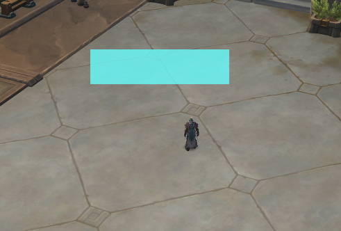
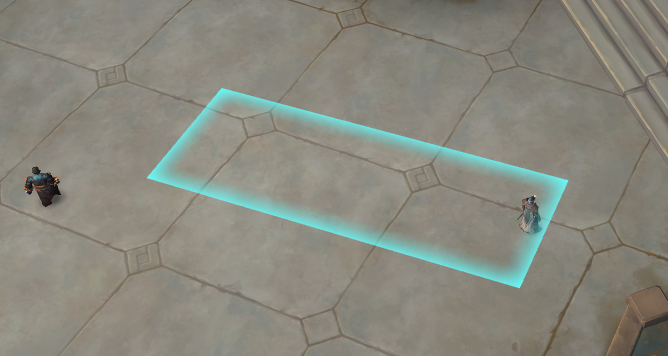
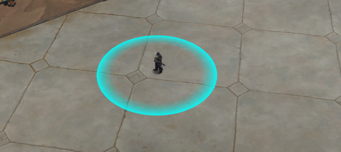

# Lua Graphics Module Documentation

## Overview

The Lua Graphics Module provides a range of functions for rendering various graphical elements in Lua scripts. This module empowers developers to create visually engaging user interfaces and enhance in-game visuals.

### Register Graphics Callback

warning

This callback should only be used for graphics, as explained in Core - Overview

`core.menu.register_on_render_callback(callback: function)`

-   This function registers the menu for interaction. Same like with other callbacks, you can also pass an anonymous function. This is how you would call the callback:

```
core.menu.register_on_render_callback(function()     -- your rendering code hereend)
```

Or:

```
local function my_render_function()    -- your rendering code hereendcore.menu.register_on_render_callback(my_render_function)
```

---

## Functions

### Line Of Sight

warning

In most cases, you should NOT use this function, since it's very expensive. Instead, you should instead use the spell_helper:is_spell_in_line_of_sight() function.

Syntax

```
core.graphics.is_line_of_sight(caster, target)
```

Parameters

-   `caster`: game_object - The caster object.
-   `target`: game_object - The target object.

Returns

-   `boolean`: `true` if the `target` is in line of sight from the `caster`, `false` otherwise.

Description

Determines if the `target` is within the line of sight of the `caster`.

---

### Cursor World Position

Syntax

```
core.graphics.get_cursor_world_position()
```

Returns

-   vec3: The current cursor position's coordinates transformed to 3D dimensions.

Description

Retrieves the current cursor position screen coordinates (2D) and returns it after transforming them to 3D.

---

### Trace Line

Syntax

```
core.graphics.trace_line(pos1, pos2, flags)
```

Parameters

-   `pos1`: vec3 - Starting position.
-   `pos2`: vec3 - Ending position.
-   `flags`: Collision flags that determine which objects to consider during tracing.

Returns

-   `boolean`: `true` if there is a valid trace line between `pos1` and `pos2`, `false` otherwise.

Description

Indicates if there is a valid trace line between `pos1` and `pos2` following the collision flags you provide.

**Collision Flags**

```
None,DoodadCollision     = 0x00000001,DoodadRender        = 0x00000002,WmoCollision        = 0x00000010,WmoRender           = 0x00000020,WmoNoCamCollision   = 0x00000040,Terrain             = 0x00000100,IgnoreWmoDoodad     = 0x00002000,LiquidWaterWalkable = 0x00010000,LiquidAll           = 0x00020000,Cull                = 0x00080000,EntityCollision     = 0x00100000,EntityRender        = 0x00200000,Collision           = DoodadCollision | WmoCollision | Terrain | EntityCollision,LineOfSight         = WmoCollision | EntityCollision
```

warning

The collision flags are located in `enums.collision_flags`. You should import the enums module:

```
---@type enumslocal enums = require("common/enums")
```

Avoid using their values directly, as this is **not recommended** since these values might change in the future. By importing the enums module, any updates will automatically be reflected in your code.

You can use this function to see which enemies are not in line of sight. You can adjust the flags according to your requirements.

## Example:

Here's an example function to gather all units that are not in line of sight within a search distance:

```
---@type unit_helperlocal unit_helper = require("common/utility/unit_helper")---@type enumslocal enums = require("common/enums")---@param search_distance number---@return table<game_object> | nillocal function get_enemies_that_are_not_in_los(search_distance)    local local_player = core.object_manager.get_local_player()    if not local_player then        return nil    end    local local_player_position = local_player:get_position()    local enemies = unit_helper:get_enemy_list_around(local_player_position, search_distance, true)    local not_in_los_enemies = {}    for _, enemy in ipairs(enemies) do        local enemy_pos = enemy:get_position()        -- trace_line will return true if the enemy is in line of sight, as long as we pass the enums.collision_flags.LineOfSight flag        local is_in_los = core.graphics.trace_line(local_player_position, enemy_pos, enums.collision_flags.LineOfSight)        if not is_in_los then            table.insert(not_in_los_enemies, enemy)        end    end    return not_in_los_enemiesend
```

note

For this example, to check if something is in **LOS** (line of sight), you could also use the `core.graphics.is_line_of_sight` function, defined earlier.

---

### World to Screen

Syntax

```
core.graphics.w2s(position)
```

Parameters

-   `position`: vec3 - The 3D world position to convert.

Returns

-   vec2: The 2D screen position corresponding to the 3D world position.

Description

Converts a 3D world position to a 2D screen position, facilitating the rendering of objects in screen space.

warning

Before using the return value, you should make sure it's not `nil`, since a `vec3` out of the screen won't be converted and will return `nil`.

## Example:

Drawing text at the 2D position of a given unit

```
---@type colorlocal color = require("common/color")---@param unit game_object---@param text stringlocal function draw_text_at_unit_screen_position(unit, text)    if not unit then        return    end    local unit_position = unit:get_position()    local unit_screen_position = core.graphics.w2s(unit_position)    if not unit_screen_position then        return    end    core.graphics.text_2d(text, unit_screen_position, 16, color.cyan(230))end
```

---

### Is Menu Open

Syntax

```
core.graphics.is_menu_open()
```

Returns

-   `boolean`: `true` if the main menu is visible, `false` otherwise.

Description

Checks if the main menu is currently open.

---

### Get Screen Size

Syntax

```
core.graphics.get_screen_size()
```

Returns

-   vec2: The width and height of the screen.

Description

Retrieves the current screen size in pixels.

---

### Render 2D Text

Syntax

```
core.graphics.text_2d(text, position, font_size, color, centered, font_id)
```

Parameters

-   `text`: `string` - The text to render.
-   `position`: vec2 - The position where the text will be rendered.
-   `font_size`: `number` - The font size of the text.
-   `color`: color - The color of the text.
-   `centered` (Optional): `boolean` - Indicates whether the text should be centered at the specified position. Default is `false`.
-   `font_id` (Optional): `integer` - The font ID. Default is `0`.

Description

Renders 2D text on the screen at the specified position with the given font size and color.

---

### Render 3D Text

Syntax

```
core.graphics.text_3d(text, position, font_size, color, centered, font_id)
```

Parameters

-   `text`: `string` - The text to render.
-   `position`: vec3 - The position in 3D space where the text will be rendered.
-   `font_size`: `number` - The font size of the text.
-   `color`: color - The color of the text.
-   `centered` (Optional): `boolean` - Indicates whether the text should be centered at the specified position. Default is `false`.
-   `font_id` (Optional): `integer` - The font ID. Default is `0`.

Description

Renders 3D text in the world at the specified position with the given font size and color.

---

### Get Text Width

Syntax

```
core.graphics.get_text_width(text, font_size, font_id)
```

Parameters

-   `text`: `string` - The text to measure.
-   `font_size`: `number` - The font size of the text.
-   `font_id` (Optional): `integer` - The font ID. Default is `0`.

Returns

-   `number`: The width of the text.

Description

Calculates and returns the width of the specified text, useful for aligning text elements.

---

### Draw 2D Line

Syntax

```
core.graphics.line_2d(start_point, end_point, color, thickness)
```

Parameters

-   `start_point`: vec2 - The start point of the line.
-   `end_point`: vec2 - The end point of the line.
-   `color`: color - The color of the line.
-   `thickness` (Optional): `number` - The thickness of the line. Default is `1`.

Description

Draws a 2D line between two points with the specified color and optional thickness.

---

### Draw 3D Line

Syntax

```
core.graphics.line_3d(start_point, end_point, color, thickness)
```

Parameters

-   `start_point`: vec3 - The start point of the line in 3D space.
-   `end_point`: vec3 - The end point of the line in 3D space.
-   `color`: color - The color of the line.
-   `thickness` (Optional): `number` - The thickness of the line. Default is `1`.

Description

Draws a 3D line between two points with the specified color and optional thickness.  

## Example:

Drawing A Line From Local Player To a Unit

```
---@type colorlocal color = require("common/color")---@param unit game_objectlocal function draw_line_to_unit(unit)    if not unit then        return    end    local local_player = core.object_manager.get_local_player()    if not local_player then        return nil    end    local local_player_position = local_player:get_position()    local unit_position = unit:get_position()    core.graphics.line_3d(local_player_position, unit_position, color.cyan(220), 5.0)end
```

---

### Draw 2D Rectangle Outline

Syntax

```
core.graphics.rect_2d(top_left_point, width, height, color, thickness, rounding)
```

Parameters

-   `top_left_point`: vec2 - The top-left corner point of the rectangle.
-   `width`: `number` - The width of the rectangle.
-   `height`: `number` - The height of the rectangle.
-   `color`: color - The color of the rectangle outline.
-   `thickness` (Optional): `number` - The thickness of the outline. Default is `1`.
-   `rounding` (Optional): `number` - The rounding of corners. Default is `0`.

Description

Draws an outlined 2D rectangle with the specified dimensions, color, and optional thickness and rounding.

---

### Draw 2D Filled Rectangle

Syntax

```
core.graphics.rect_2d_filled(top_left_point, width, height, color, rounding)
```

Parameters

-   `top_left_point`: vec2 - The top-left corner point of the rectangle.
-   `width`: `number` - The width of the rectangle.
-   `height`: `number` - The height of the rectangle.
-   `color`: color - The fill color of the rectangle.
-   `rounding` (Optional): `number` - The rounding of corners. Default is `0`.

Description

Draws a filled 2D rectangle with the specified dimensions, color, and optional rounding.  

## Example:

Drawing a 2d filled rect at cursor screen position

```
---@type colorlocal color = require("common/color")local function render_rect_2d_at_cursor_screen_pos()    local local_player = core.object_manager.get_local_player()    if not local_player then        return nil    end    local cursor_pos_2d = core.get_cursor_position()    core.graphics.rect_2d_filled(cursor_pos_2d, 200, 50, color.cyan_pale(200))end
```



---

### Draw 3D Rectangle Outline

Syntax

```
core.graphics.rect_3d(p1, p2, p3, p4, color, thickness)
```

Parameters

-   `p1`, `p2`, `p3`, `p4`: vec3 - Four points defining the corners of the rectangle in 3D space.
-   `color`: color - The color of the rectangle outline.
-   `thickness` (Optional): `number` - The thickness of the outline. Default is `1`.

Description

Draws an outlined 3D rectangle with the specified corner points, color, and optional thickness.  

## Example:

How to Render a 3D Rectangle From Local Player to Mouse Position  

```
---@type colorlocal color = require("common/color")local function render_rect_3d_to_mouse()    local local_player = core.object_manager.get_local_player()    if not local_player then        return nil    end    local local_player_position = local_player:get_position()    local cursor_position_3d = core.graphics.get_cursor_world_position()    core.graphics.rect_3d(local_player_position, cursor_position_3d, 5.0, color.cyan_pale(200), 30.0, 1.5)end
```



---

### Draw 3D Rectangle Outline New

Syntax

```
core.graphics.render_rect_3d_new(start_pos, end_pos, width, thickness, color)
```

Parameters

-   `start_pos`: vec3 - Start position of the rectangle center line.
-   `end_pos`: vec3 - End position of the rectangle center line.
-   `width`: `number` - Perpendicular width of the rectangle.
-   `thickness`: `number` - Outline thickness.
-   `color`: color - The outline color.

Description

Draws a crisp 3D rectangle outline that stays inside the requested bounds. This newer renderer avoids the legacy `rect_3d` thickness compensation behavior.

---

### Draw 3D Filled Rectangle

Syntax

```
core.graphics.rect_3d_filled(p1, p2, p3, p4, color)
```

Parameters

-   `p1`, `p2`, `p3`, `p4`: vec3 - Four points defining the corners of the rectangle in 3D space.
-   `color`: color - The fill color of the rectangle.

Description

Draws a filled 3D rectangle with the specified corner points and color.

---

### Draw 3D Filled Rectangle New

Syntax

```
core.graphics.render_rect_3d_filled_new(start_pos, end_pos, width, color)
```

Parameters

-   `start_pos`: vec3 - Start position of the rectangle center line.
-   `end_pos`: vec3 - End position of the rectangle center line.
-   `width`: `number` - Perpendicular width of the rectangle.
-   `color`: color - The fill color.

Description

Draws a filled 3D rectangle using the newer anti-aliased 3D rectangle renderer.

---

### Draw 3D Polygon

Syntax

```
core.graphics.render_polygon_3d(points, color, filled, thickness, border_fade)
```

Parameters

-   `points`: vec3[] - Vertices in ring order. The renderer accepts up to 64 points.
-   `color`: color - Fill or outline color.
-   `filled`: `boolean` - `true` for a filled polygon, `false` for an outline.
-   `thickness` (Optional): `number` - Outline width in pixels when `filled` is `false`. Default is `2`.
-   `border_fade` (Optional): `number` - Edge feather width in pixels. Default is `2`; use `0` for a crisp anti-aliased edge.

Description

Draws a 3D polygon from world-space vertices. Convex and concave simple polygons are supported.

Example Usage

```
local me = core.object_manager.get_local_player()if not me then return endlocal pos = me:get_position()local points = {    vec3.new(pos.x + 3, pos.y, pos.z),    vec3.new(pos.x, pos.y + 3, pos.z),    vec3.new(pos.x - 3, pos.y, pos.z),    vec3.new(pos.x, pos.y - 3, pos.z),}core.graphics.render_polygon_3d(points, color.cyan(180), true)
```

---

### Draw 2D Circle Outline

Syntax

```
core.graphics.circle_2d(center, radius, color, thickness)
```

Parameters

-   `center`: vec2 - The center point of the circle.
-   `radius`: `number` - The radius of the circle.
-   `color`: color - The color of the circle outline.
-   `thickness` (Optional): `number` - The thickness of the outline. Default is `1`.

Description

Draws an outlined 2D circle with the specified center, radius, color, and optional thickness.

---

### Draw 2D Filled Circle

Syntax

```
core.graphics.circle_2d_filled(center, radius, color)
```

Parameters

-   `center`: vec2 - The center point of the circle.
-   `radius`: `number` - The radius of the circle.
-   `color`: color - The fill color of the circle.

Description

Draws a filled 2D circle with the specified center, radius, and color.

---

### Draw 3D Circle Outline

Syntax

```
core.graphics.circle_3d(center, radius, color, thickness)
```

Parameters

-   `center`: vec3 - The center point of the circle in 3D space.
-   `radius`: `number` - The radius of the circle.
-   `color`: color - The color of the circle.
-   `thickness` (Optional): `number` - The thickness of the lines forming the circle.

Description

Draws an outlined 3D circle with the specified center, radius, color, and optional thickness.  

## Example:

How to Render a 3D Circle at Unit's Position  

```
---@type colorlocal color = require("common/color")local function render_rect_3d_at_unit_position(unit)    if not unit then        return    end    -- you can avoid this check if you checked it earlier in your code.    -- It's just to make sure nothing is rendered while on loading screen.    local local_player = core.object_manager.get_local_player()    if not local_player then        return nil    end    local unit_position = unit:get_position()    core.graphics.circle_3d(unit_position, 5.0, color.cyan(230), 40, 1.5)end
```



---

### Draw 3D Circle Outline Percentage

Syntax

```
core.graphics.circle_3d_percentage(center, radius, color, percentage, thickness)
```

Parameters

-   `center`: vec3 - The center point of the circle in 3D space.
-   `radius`: `number` - The radius of the circle.
-   `color`: color - The color of the circle outline.
-   `percentage`: `number` - The percentage of the circle to render.
-   `thickness` (Optional): `number` - The thickness of the outline. Default is `1`.

Description

Draws an outlined 3D circle with the specified center, radius, color, and percentage of the circle to render. Optionally, the thickness can be specified.

tip

This function might be useful to track casts, since you can render the circle up to a unit's current cast completion percentage, for example.

---

### Draw 3D Filled Circle

Syntax

```
core.graphics.circle_3d_filled(center, radius, color)
```

Parameters

-   `center`: vec3 - The center point of the circle in 3D space.
-   `radius`: `number` - The radius of the circle.
-   `color`: color - The fill color of the circle.

Description

Draws a filled 3D circle with the specified center, radius, and color.

---

### Draw 2D Filled Triangle

Syntax

```
core.graphics.triangle_2d_filled(p1, p2, p3, color)
```

Parameters

-   `p1`, `p2`, `p3`: vec2 - Three points defining the corners of the triangle in 2D space.
-   `color`: color - The fill color of the triangle.

Description

Draws a filled 2D triangle with the specified corner points and color.

---

### Draw 3D Filled Triangle

Syntax

```
core.graphics.triangle_3d_filled(p1, p2, p3, color)
```

Parameters

-   `p1`, `p2`, `p3`: vec3 - Three points defining the corners of the triangle in 3D space.
-   `color`: color - The fill color of the triangle.

Description

Draws a filled 3D triangle with the specified corner points and color.

---

### Draw 2D Gradient Circle

Syntax

```
core.graphics.circle_2d_gradient(center, radius, color_1, color_2, color_3, thickness)
```

Parameters

-   `center`: vec2 - The center point of the circle.
-   `radius`: `number` - The radius of the circle.
-   `color_1`: color - The first gradient color.
-   `color_2`: color - The second gradient color.
-   `color_3`: color - The third gradient color.
-   `thickness` (Optional): `number` - The thickness of the outline. Default is `1`.

Description

Draws a gradient 2D circle with the specified center, radius, colors, and optional thickness.

---

### Draw 3D Gradient Circle

Syntax

```
core.graphics.circle_3d_gradient(center, radius, color_1, color_2, color_3, thickness)
```

Parameters

-   `center`: vec3 - The center point of the circle in 3D space.
-   `radius`: `number` - The radius of the circle.
-   `color_1`: color - The first gradient color.
-   `color_2`: color - The second gradient color.
-   `color_3`: color - The third gradient color.
-   `thickness` (Optional): `number` - The thickness of the outline. Default is `1`.

Description

Draws a gradient 3D circle with the specified center, radius, colors, and optional thickness.

---

### Draw 3D Gradient Circle Percentage

Syntax

```
core.graphics.circle_3d_gradient_percentage(center, radius, color_1, color_2, color_3, percentage, thickness)
```

Parameters

-   `center`: vec3 - The center point of the circle in 3D space.
-   `radius`: `number` - The radius of the circle.
-   `color_1`: color - The first gradient color.
-   `color_2`: color - The second gradient color.
-   `color_3`: color - The third gradient color.
-   `percentage`: `number` - The percentage of the circle to render.
-   `thickness` (Optional): `number` - The thickness of the outline. Default is `1`.

Description

Draws a partial gradient 3D circle with the specified center, radius, colors, percentage, and optional thickness.

---

### Draw 3D Cone

Syntax

```
core.graphics.cone_3d(center, target_pos, radius, angle_degrees, color, fade_power)
```

Parameters

-   `center`: vec3 - The origin point of the cone in 3D space.
-   `target_pos`: vec3 - The target position the cone is aimed at.
-   `radius`: `number` - The radius of the cone.
-   `angle_degrees`: `number` - The angle of the cone in degrees.
-   `color`: color - The color of the cone.
-   `fade_power` (Optional): `number` - The fade power of the cone.

Description

Draws a 3D cone from the center towards the target position with the specified radius, angle, color, and optional fade power.

---

### Translate Virtual Key to String

Syntax

```
core.graphics.translate_vkey_to_string(key)
```

Parameters

-   `key`: `integer` - The virtual key code.

Returns

-   `string`: A human-readable string representation of the virtual key code.

Description

Converts a virtual key code to a human-readable string.

---

### Scale Width to Screen Size

Syntax

```
core.graphics.scale_width_to_screen_size(value, main_resolution)
```

Parameters

-   `value`: `number` - The width value to scale.
-   `main_resolution`: `number` - The reference resolution width.

Returns

-   `number`: The scaled width value matching the current screen size.

Description

Scales a width value to match the current screen size based on a reference resolution.

---

### Scale Height to Screen Size

Syntax

```
core.graphics.scale_height_to_screen_size(value, main_resolution)
```

Parameters

-   `value`: `number` - The height value to scale.
-   `main_resolution`: `number` - The reference resolution height.

Returns

-   `number`: The scaled height value matching the current screen size.

Description

Scales a height value to match the current screen size based on a reference resolution.

---

### Scale Size to Screen Size

Syntax

```
core.graphics.scale_size_to_screen_size(value, main_resolution)
```

Parameters

-   `value`: vec2 - The size to scale.
-   `main_resolution`: vec2 - The reference resolution.

Returns

-   vec2: The scaled size matching the current screen size.

Description

Scales a size to match the current screen size based on a reference resolution.

---

### Native Intersect

Syntax

```
core.graphics.native_intersect(end_pos, start_pos, distance, hit_mask)
```

Parameters

-   `end_pos`: vec3 - The end position of the ray.
-   `start_pos`: vec3 - The start position of the ray.
-   `distance` (Optional): `number` - The maximum ray distance.
-   `hit_mask`: `integer` - The hit mask flags for the intersection test.

Returns

-   `boolean`: `true` if the ray intersected something, `false` otherwise.
-   vec3: The position where the ray hit.
-   `number`: The distance of the hit from the start position.

Description

Performs a ray intersection test from the start position to the end position. Returns whether a hit occurred, the hit position, and the hit distance.

---

### Load Font

Syntax

```
core.graphics.load_font(font_data, font_size)
```

Parameters

-   `font_data`: `string` - The raw binary data of the font.
-   `font_size`: `number` - The font size.

Returns

-   `integer`: The font ID that can be used with text rendering functions.

Description

Loads a custom font from raw binary data and returns a font ID for use with text rendering functions.

---

### Load Image

Syntax

```
core.graphics.load_image(path_to_asset)
```

Parameters

-   `path_to_asset`: `string` - The path to the image asset in scripts_data.

Description

Loads an image from scripts_data for later rendering.

---

### Draw Image

Syntax

```
core.graphics.draw_image(image, position)
```

Parameters

-   `image`: The loaded image object.
-   `position`: vec2 - The position where the image will be drawn.

Description

Draws a previously loaded image at the specified screen position.

---

### Load Texture

Syntax

```
core.graphics.load_texture(image_data)
```

Parameters

-   `image_data`: `string` - The raw binary data of the texture.

Returns

-   `integer`: The texture ID for use with texture drawing functions.

Description

Loads a texture from raw binary data and returns a texture ID.

---

### Draw Texture

Syntax

```
core.graphics.draw_texture(texture_id, top_left, width, height, color, is_for_window)
```

Parameters

-   `texture_id`: `integer` - The texture ID returned by `load_texture`.
-   `top_left`: vec2 - The top-left position to draw the texture.
-   `width`: `number` - The width of the texture.
-   `height`: `number` - The height of the texture.
-   `color` (Optional): color - The tint color of the texture.
-   `is_for_window` (Optional): `boolean` - Whether the texture is for a window.

Description

Draws a loaded texture at the specified position with the given dimensions and optional color tint.

---

### Draw Texture Rect

Syntax

```
core.graphics.draw_texture_rect(texture_id, top_left, width, height, uv0_x, uv0_y, uv1_x, uv1_y, color, is_for_window)
```

Parameters

-   `texture_id`: `integer` - The texture ID returned by `load_texture`.
-   `top_left`: vec2 - The top-left position to draw the texture.
-   `width`: `number` - The width of the texture.
-   `height`: `number` - The height of the texture.
-   `uv0_x`: `number` - The U coordinate of the top-left UV.
-   `uv0_y`: `number` - The V coordinate of the top-left UV.
-   `uv1_x`: `number` - The U coordinate of the bottom-right UV.
-   `uv1_y`: `number` - The V coordinate of the bottom-right UV.
-   `color` (Optional): color - The tint color of the texture.
-   `is_for_window` (Optional): `boolean` - Whether the texture is for a window.

Description

Draws a textured rectangle with UV coordinates, allowing you to render a specific portion of a texture.

---

### Scissor Push

Syntax

```
core.graphics.scissor_push(x, y, w, h)
```

Parameters

-   `x`: `number` - The x-position of the clipping rectangle.
-   `y`: `number` - The y-position of the clipping rectangle.
-   `w`: `number` - The width of the clipping rectangle.
-   `h`: `number` - The height of the clipping rectangle.

Description

Pushes a clipping rectangle onto the scissor stack. All subsequent draw calls will be clipped to this rectangle.

---

### Scissor Pop

Syntax

```
core.graphics.scissor_pop()
```

Description

Pops the current clipping rectangle from the scissor stack.

---

### Capture Next Mouse Input

Syntax

```
core.graphics.capture_next_mouse_input()
```

Description

Captures the next mouse input event.

---

### Capture Next Keyboard Input

Syntax

```
core.graphics.capture_next_keyboard_input()
```

Description

Captures the next keyboard input event.

---

### Set Mouse Capture State

Syntax

```
core.graphics.set_mouse_capture_state(state)
```

Parameters

-   `state`: `boolean` - Whether to enable or disable hard mouse input capture.

Description

Sets the hard mouse input capture state.

---

### Set Keyboard Capture State

Syntax

```
core.graphics.set_keyboard_capture_state(state)
```

Parameters

-   `state`: `boolean` - Whether to enable or disable hard keyboard input capture.

Description

Sets the hard keyboard input capture state.

---

### Get Main Menu Screen Position

Syntax

```
core.graphics.get_main_menu_screen_pos()
```

Returns

-   vec2: The main menu screen position.

Description

Returns the main menu screen position.

---

### Get Main Menu Screen Size

Syntax

```
core.graphics.get_main_menu_screen_size()
```

Returns

-   vec2: The main menu screen size.

Description

Returns the main menu screen size.

---

### Get Current Control Panel Element Label

Syntax

```
core.graphics.get_current_control_panel_element_label()
```

Returns

-   `string`: The current control panel element label.

Description

Gets the label of the current control panel element.

---

### Set Current Control Panel Element Label

Syntax

```
core.graphics.set_current_control_panel_element_label(label)
```

Parameters

-   `label`: `string` - The label to set for the current control panel element.

Description

Sets the label of the current control panel element.

---

### Render System Menu

Syntax

```
core.graphics.render_system_menu()
```

Description

Renders the system menu.

---

## GIF Support

### Load GIF

Syntax

```
core.graphics.load_gif(gif_data)
```

Parameters

-   `gif_data`: `string` - The raw binary data of the GIF file.

Returns

-   `integer`: The GIF ID for use with `draw_gif`.
-   `integer`: The width of the GIF in pixels.
-   `integer`: The height of the GIF in pixels.
-   `integer`: The total number of frames.
-   `integer`: The total animation duration in milliseconds.

Returns `nil` if the GIF data is invalid or could not be parsed.

Description

Loads an animated GIF from raw binary data and returns a GIF ID along with its dimensions and timing info. If the GIF was already loaded, the cached metadata is returned immediately. Frame upload to the GPU happens asynchronously — `draw_gif` silently no-ops until frames are ready.

**Example Usage**

```
local gif_data = core.read_file("my_animation.gif")local gif_id, w, h, frames, duration_ms = core.graphics.load_gif(gif_data)if gif_id then    core.log("Loaded GIF: " .. w .. "x" .. h .. ", " .. frames .. " frames, " .. duration_ms .. "ms")end
```

---

### Draw GIF

Syntax

```
core.graphics.draw_gif(gif_id, top_left, width, height, color, is_for_window, speed)
```

Parameters

-   `gif_id`: `integer` - The GIF ID returned by `load_gif`.
-   `top_left`: vec2 - The top-left position to draw the GIF.
-   `width`: `number` - The display width.
-   `height`: `number` - The display height.
-   `color` (Optional): color - The tint color. Default is white.
-   `is_for_window` (Optional): `boolean` - Whether the GIF is for a window draw list. Default is `false`.
-   `speed` (Optional): `number` - The playback speed multiplier. Default is `1.0`.

Description

Draws an animated GIF at the specified position. The current frame is selected automatically based on elapsed time and the speed multiplier. Silently skips if the GIF frames have not finished uploading to the GPU yet.

**Example Usage**

```
-- Draw at half speedcore.graphics.draw_gif(gif_id, vec2:new(100, 100), 200, 150, nil, false, 0.5)
```

---

## SDF Shader Rendering

GPU-accelerated pixel shader functions for modern UI rendering. All SDF functions use screen-space coordinates (vec2 min/max corners).

### Render Smooth Rect

Syntax

```
core.graphics.render_smooth_rect(p_min, p_max, color, rounding, softness)
```

Parameters

-   `p_min`: vec2 - Top-left corner.
-   `p_max`: vec2 - Bottom-right corner.
-   `color`: color - The fill color.
-   `rounding` (Optional): `number` - Corner rounding radius. Default `4.0`.
-   `softness` (Optional): `number` - Edge softness. Default `1.0`.

Description

Draws a filled rectangle with smooth (anti-aliased) edges using a pixel shader.

---

### Render Drop Shadow

Syntax

```
core.graphics.render_drop_shadow(p_min, p_max, color, offset_x, offset_y, element_w, element_h, rounding, softness, spread)
```

Parameters

-   `p_min`: vec2 - Top-left corner of the shadow quad.
-   `p_max`: vec2 - Bottom-right corner of the shadow quad.
-   `color`: color - The shadow color.
-   `offset_x`: `number` - Horizontal shadow offset.
-   `offset_y`: `number` - Vertical shadow offset.
-   `element_w`: `number` - Width of the element casting the shadow.
-   `element_h`: `number` - Height of the element casting the shadow.
-   `rounding` (Optional): `number` - Corner rounding radius. Default `6.0`.
-   `softness` (Optional): `number` - Shadow blur softness. Default `8.0`.
-   `spread` (Optional): `number` - Shadow spread. Default `0.0`.

Description

Draws a GPU-accelerated drop shadow behind a UI element.

---

### Render Border Rect

Syntax

```
core.graphics.render_border_rect(p_min, p_max, fill, border, rounding, softness, thickness)
```

Parameters

-   `p_min`: vec2 - Top-left corner.
-   `p_max`: vec2 - Bottom-right corner.
-   `fill`: color - The fill color.
-   `border`: color - The border color.
-   `rounding` (Optional): `number` - Corner rounding radius. Default `4.0`.
-   `softness` (Optional): `number` - Edge softness. Default `1.0`.
-   `thickness` (Optional): `number` - Border thickness. Default `1.0`.

Description

Draws a filled rectangle with a smooth border using a pixel shader.

---

### Render Linear Gradient

Syntax

```
core.graphics.render_linear_gradient(p_min, p_max, color_a, color_b, angle, rounding, softness)
```

Parameters

-   `p_min`: vec2 - Top-left corner.
-   `p_max`: vec2 - Bottom-right corner.
-   `color_a`: color - The start gradient color.
-   `color_b`: color - The end gradient color.
-   `angle` (Optional): `number` - Gradient angle in radians. Default `0.0`.
-   `rounding` (Optional): `number` - Corner rounding radius. Default `0.0`.
-   `softness` (Optional): `number` - Edge softness. Default `0.0`.

Description

Draws a rectangle filled with a linear gradient between two colors.

---

### Render Keybind Pill

Syntax

```
core.graphics.render_keybind_pill(p_min, p_max, base, elev, accent, rounding, hover, listening, time_val, speed)
```

Parameters

-   `p_min`: vec2 - Top-left corner.
-   `p_max`: vec2 - Bottom-right corner.
-   `base`: color - The base color.
-   `elev`: color - The elevation/highlight color.
-   `accent`: color - The accent color.
-   `rounding` (Optional): `number` - Corner rounding radius. Default `6.0`.
-   `hover` (Optional): `number` - Hover interpolation value (0.0-1.0). Default `0.0`.
-   `listening` (Optional): `number` - Listening/active state value (0.0-1.0). Default `0.0`.
-   `time_val` (Optional): `number` - Animation time value. Default `0.0`.
-   `speed` (Optional): `number` - Animation speed multiplier. Default `1.0`.

Description

Draws a styled keybind pill button with hover and listening state animations.

---

### Render Dropdown Field

Syntax

```
core.graphics.render_dropdown_field(p_min, p_max, base, elev, accent, rounding, hover, open, time_val, speed)
```

Parameters

-   `p_min`: vec2 - Top-left corner.
-   `p_max`: vec2 - Bottom-right corner.
-   `base`: color - The base color.
-   `elev`: color - The elevation/highlight color.
-   `accent`: color - The accent color.
-   `rounding` (Optional): `number` - Corner rounding radius. Default `4.0`.
-   `hover` (Optional): `number` - Hover interpolation value (0.0-1.0). Default `0.0`.
-   `open` (Optional): `number` - Open state value (0.0-1.0). Default `0.0`.
-   `time_val` (Optional): `number` - Animation time value. Default `0.0`.
-   `speed` (Optional): `number` - Animation speed multiplier. Default `1.0`.

Description

Draws a styled dropdown field with hover and open state animations.

---

### Render Section Header

Syntax

```
core.graphics.render_section_header(p_min, p_max, primary, secondary, accent, head_split, rounding, hover, open, time_val, speed)
```

Parameters

-   `p_min`: vec2 - Top-left corner.
-   `p_max`: vec2 - Bottom-right corner.
-   `primary`: color - The primary color.
-   `secondary`: color - The secondary color.
-   `accent`: color - The accent color.
-   `head_split` (Optional): `number` - Header split ratio. Default `1.0`.
-   `rounding` (Optional): `number` - Corner rounding radius. Default `4.0`.
-   `hover` (Optional): `number` - Hover interpolation value (0.0-1.0). Default `0.0`.
-   `open` (Optional): `number` - Open/collapsed state value (0.0-1.0). Default `0.0`.
-   `time_val` (Optional): `number` - Animation time value. Default `0.0`.
-   `speed` (Optional): `number` - Animation speed multiplier. Default `1.0`.

Description

Draws a styled collapsible section header with hover and open/close animations.

---

### Render Slider Track

Syntax

```
core.graphics.render_slider_track(p_min, p_max, fill_lo, fill_hi, rail, fill_t, rounding, hover, time_val, speed)
```

Parameters

-   `p_min`: vec2 - Top-left corner.
-   `p_max`: vec2 - Bottom-right corner.
-   `fill_lo`: color - The fill color at the low end.
-   `fill_hi`: color - The fill color at the high end.
-   `rail`: color - The unfilled rail color.
-   `fill_t`: `number` - The fill amount (0.0-1.0).
-   `rounding` (Optional): `number` - Corner rounding radius. Default `3.0`.
-   `hover` (Optional): `number` - Hover interpolation value (0.0-1.0). Default `0.0`.
-   `time_val` (Optional): `number` - Animation time value. Default `0.0`.
-   `speed` (Optional): `number` - Animation speed multiplier. Default `1.0`.

Description

Draws a styled slider track with a gradient fill and unfilled rail.

---

### Render Hover Pill

Syntax

```
core.graphics.render_hover_pill(p_min, p_max, base, streak, rounding, softness, density, time_val, speed)
```

Parameters

-   `p_min`: vec2 - Top-left corner.
-   `p_max`: vec2 - Bottom-right corner.
-   `base`: color - The base color.
-   `streak`: color - The animated streak color.
-   `rounding` (Optional): `number` - Corner rounding radius. Default `6.0`.
-   `softness` (Optional): `number` - Edge softness. Default `1.0`.
-   `density` (Optional): `number` - Streak density. Default `1.0`.
-   `time_val` (Optional): `number` - Animation time value. Default `0.0`.
-   `speed` (Optional): `number` - Animation speed multiplier. Default `1.0`.

Description

Draws a pill-shaped hover highlight with animated streaking effects.

---

### Render Circle Percentage

Syntax

```
core.graphics.render_circle_percentage(p_min, p_max, bg_color, fill_start_color, fill_end_color, progress, start_angle_rad, direction, inner_norm, outer_norm, softness)
```

Parameters

-   `p_min`: vec2 - Top-left corner in screen space.
-   `p_max`: vec2 - Bottom-right corner in screen space.
-   `bg_color`: color - Background ring color.
-   `fill_start_color`: color - Fill gradient start color.
-   `fill_end_color`: color - Fill gradient end color.
-   `progress`: `number` - Fill fraction from `0.0` to `1.0`.
-   `start_angle_rad` (Optional): `number` - Arc start angle in radians. Default is `-pi/2`.
-   `direction` (Optional): `number` - Positive values draw clockwise, negative values draw counter-clockwise. Default is `1.0`.
-   `inner_norm` (Optional): `number` - Inner radius normalized from `0.0` to `1.0`. Default is `0.70`.
-   `outer_norm` (Optional): `number` - Outer radius normalized from `0.0` to `1.0`. Default is `0.98`.
-   `softness` (Optional): `number` - Edge softness in pixels. Default is `1.0`.

Description

Draws a 2D circular progress ring using an SDF pixel shader. Use this for UI cooldown rings, cast progress, or compact status indicators.

---

### Render Circle Percentage 3D

Syntax

```
core.graphics.render_circle_percentage_3d(world_pos, world_radius, bg_color, fill_start_color, fill_end_color, progress, start_angle_rad, direction, inner_norm, outer_norm, softness)
```

Parameters

-   `world_pos`: vec3 - Center position in world space.
-   `world_radius`: `number` - Circle radius in world units.
-   `bg_color`: color - Background ring color.
-   `fill_start_color`: color - Fill gradient start color.
-   `fill_end_color`: color - Fill gradient end color.
-   `progress`: `number` - Fill fraction from `0.0` to `1.0`.
-   `start_angle_rad` (Optional): `number` - Arc start angle in radians. Default is `-pi/2`.
-   `direction` (Optional): `number` - Positive values draw clockwise, negative values draw counter-clockwise. Default is `1.0`.
-   `inner_norm` (Optional): `number` - Inner radius normalized from `0.0` to `1.0`. Default is `0.70`.
-   `outer_norm` (Optional): `number` - Outer radius normalized from `0.0` to `1.0`. Default is `0.98`.
-   `softness` (Optional): `number` - Edge softness in pixels. Default is `1.0`.

Description

Draws a circular progress ring in world space using the same SDF shader as `render_circle_percentage`.