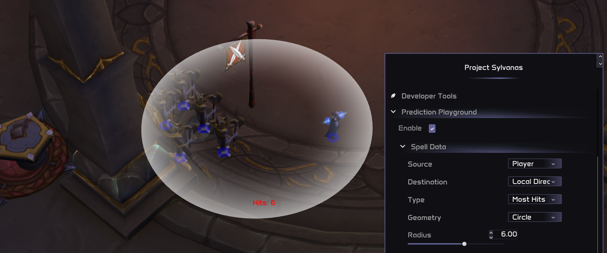

# Input Functions and Spell Queue

## Overview

In this module we introduce one of the most (if not the most) important features for scripting: a way to manage input from code. For now, this only includes spell casting. However, stay tuned to the changelogs, since other input methods like movement are planned to be supported in the near future.

## The Way Raw Input Functions Work

Similar to what we previously discussed in the [buffs](https://docs.project-sylvanas.net/dev/api/buffs) page, the raw input functions that the game provides to us have some disadvantages. In this case, they are not FPS-related, but rather usability and safety related. These functions basically send a paquet to the game's server that mimics a legit spell cast or movement. Therefore, spamming raw inputs from code may be dangerous since you might be sending many more requests per seconds than any human would be able to send. So far, this is not a problem for us, but it's something to take into account for the future, as Blizzard anticheat evolves.  
  
The real problem is usability:  
1 - **Compatibility between plugins**: If your scripts spam input requests, you will make everything else useless. For example, other modules like "Core Interrupt" might want to cast a spell to interrupt an important enemy cast. This usually has more priority than the normal damage rotation, but since you are flooding the server with your requests, the interruptor spell cast request won't have a chance to be sent.  
2 - **User Experience**: If your script spam input requests you make the user unable to cast their own spells manually. As you could imagine, there might me certain situations in which the users have to cast certain spells on their own, so blocking this could be very frustrating them. To fix this, we handle everything in our LUA Spell Queue Module, which will be explained in detail below.

> **warning**
> 
> You can still use raw input functions, but at your own risk. We advise you to read thoroughly the previous explanation and check if you really really need to use the raw functions. If you have any question, contact us and we will guide you through without any problem - Better safe than sorry.

> **note**
> 
> For some items that don't have global cooldown, the raw "Use Item" functions are perfectly fine, just make sure to add checks before the cast so you don't spam when the item isn't ready.

## Raw Input Functions

### Cast Target Spell

`core.input.cast_target_spell(spell_id: integer, target: game_object) -> boolean`

- Cast a spell directly at a target.
- Parameters:
  - `spell_id`: The ID of your chosen spell
  - `target`: The game_object that you want to cast the spell to
- Returns: `true` if the spell was cast, `false` if it fizzled

> **note**
> 
> This function JUST sends a cast request to the server. It doesn't check if the enemy is close enough, if you are facing it, if the spell is ready, etc. Therefore, you must apply all these checks before casting.

### Cast Position Spell

`core.input.cast_position_spell(spell_id: integer, position: vec3) -> boolean`

- Cast a spell at a specific location in the world.
- Parameters:
  - `spell_id`: Your spell's ID
  - `position`: The XYZ coordinates for your spell
- Returns: `true` if cast successfully, `false` if not

> **note**
> 
> This function is only used for spells that don't require a target game_object, but instead require a target position. This is usually the case for some AOE spells like Blizzard or Flamestrike.

### Use Item

We have three item usage functions:

1. **Item Self-Cast**: `core.input.use_item(item_id: integer) -> boolean` - Items that don't require a target
2. **Item Targeted-Cast**: `core.input.use_item_target(item_id: integer, target: game_object) -> boolean` - Items that require a target
3. **Item Position-Cast**: `core.input.use_item_position(item_id: integer, position: vec3) -> boolean` - Use an item at a specific location

### Use Container Item

`core.input.use_container_item(container_id: integer, slot_id: integer)`

- Use an item directly from a bag container by its bag index and slot index.

### Vendor Interaction

**`buy_item(index, quantity)`** - Purchases an item from the currently open vendor window.

**`repair_all_items(use_guild_bank)`** - Repairs all equipped items at a repair-capable vendor.

### Set Target

`core.input.set_target(unit: game_object) -> boolean` - Set your current target.

### Set and Get Focus

- `core.input.set_focus(unit: game_object) -> boolean`: Set your focus target
- `core.input.get_focus() -> game_object | nil`: Retrieve your current focus

## Spell Queue Module: Advanced Spell Management

As discussed earlier, spell_queue module offers sophisticated spell management with priority queuing. It's the go-to tool for complex spell rotations and efficient casting, and what you should be using in most cases.

### Importing the Module

```lua
---@type spell_queue
local spell_queue = require("common/modules/spell_queue")
```

### Queue Spell with Target

`spell_queue:queue_spell_target(spell_id: number, target: game_object, priority: number, message?: string)`

- Queue a targeted spell with priority.
- `priority`: Higher numbers = higher priority (1 is default, 9 is highest)
- `message`: Optional logging message

### Queue Fast Spell with Target

`spell_queue:queue_spell_target_fast(spell_id: number, target: game_object, priority: number, message?: string)`

### Queue Spell with Position

`spell_queue:queue_spell_position(spell_id: number, position: vec3, priority: number, message?: string)`



> **note**
> 
> As you can see, we call `prediction_type.MOST_HITS` to fire Death and Decay on the Priest. Instead of casting on the center, it strategically places the spell slightly to the left to hit extra dummies aswell.

### Queue Fast Spell with Position

`spell_queue:queue_spell_position_fast(spell_id: number, position: vec3, priority: number, message?: string)`

## Best Practices

1. **Embrace the Spell Queue**
2. **Remember the priority scale (1-9)**. Use it to create sophisticated casting logic.

> **warning**
> 
> Be cautious with priority levels! While `1` is the default, higher priorities should be applied only when absolutely necessary.

`1` is the default priority, intended for the majority of spells in the standard rotation. Higher priorities are intended for spells that require urgent action outside the rotation. **For example, interrupts use priority `7`**. Core utility spells, such as racials, dispels, or spell reflections, are typically set between **`4` to `6`**. Finally, **priority `9`** is exclusively reserved for **manual player actions**.

3. **Fast Track Important Spells** - Use `_fast` versions for critical, non-GCD spells.
4. **Leave Breadcrumbs** - Use the `message` parameter in spell_queue for easier debugging.
5. **Learn to Use The Prediction Module**

## More Raw Input Functions

### Keyboard and Input State

- `is_key_pressed(key)` - Checks if the specified key is currently being pressed
- `is_input_bit_active(bit_flag)` - Checks if a specific input bit flag is currently active

### Movement Controls

- `move_up_start()` / `move_up_stop()`
- `move_down_start()` / `move_down_stop()`
- `jump()`

### Expanded Movement Controls

- `move_forward_start()` / `move_forward_stop()`
- `move_backward_start()` / `move_backward_stop()`
- `turn_right_start()` / `turn_right_stop()`
- `turn_left_start()` / `turn_left_stop()`
- `strafe_right_start()` / `strafe_right_stop()`
- `strafe_left_start()` / `strafe_left_stop()`

### Facing and Movement Lock

- `look_at(point)` - Faces the local player towards a world position (horizontal only)
- `look_at_3d(point)` - Faces the local player towards a world position (includes vertical pitch)
- `set_pitch(radians)` - Sets the player's vertical look angle
- `enable_movement()` - Re-enables player movement
- `disable_movement(is_lock)` - Disables player movement

### Spell Cancellation

- `cancel_spells()` - Cancels any spells currently being cast
- `stop_spell_target()` - Stops the current spell targeting mode
- `cancel_buff(buff_otr)` - Cancels a specific buff from the local player

### Mounting and Dismounting

- `mount(mount_index)` - Mounts a specific mount by its index
- `dismount()` - Dismounts the player from their mount

### Resurrection and Spirit Release

- `release_spirit()` - Releases the player's spirit after death
- `resurrect_corpse()` - Sends the player back to their corpse for resurrection

### Combat

- `stop_attack()` - Stops all ongoing player attacks

### Pet Control Functions

- `pet_move(target)` / `pet_move_position(position)`
- `pet_attack(target)`
- `pet_cast_target_spell(spell_id, target)` / `pet_cast_position_spell(spell_id, position)`
- `set_pet_passive()` / `set_pet_defensive()` / `set_pet_aggressive()` / `set_pet_assist()`
- `set_pet_wait()` / `set_pet_follow()`

### Loot and Object Interaction

- `loot_object(target)` - Loots the specified game object
- `loot_item(index)` - Loots a specific item from the loot window
- `close_loot()` - Closes the currently open loot window
- `skin_object(target)` - Skins a specified game object
- `use_object(target)` - Uses a specified game object
- `interact_with_object(target)` - Interacts with a specified game object

### Battleground and Dungeon Finder

- `accept_battlefield_port(index, is_accept)` - Accepts or declines a battlefield port
- `join_battlefield(battlefield_id, role_flags)` - Queues for a specific battlefield
- `leave_battlefield()` - Leaves the current battlefield
- `leave_party()` - Leaves the current party or group
- `select_dungeon(category_id, dungeon_id)` - Selects a dungeon
- `join_dungeon(category_id, role_flags)` - Queues for dungeons
- `has_dungeon_proposal()` - Checks for pending dungeon proposal
- `accept_dungeon_proposal(is_accept)` - Accepts or declines dungeon proposal
- `clear_dungeon_selections(index)` - Clears dungeon selections

### Pet Autocast

- `core.input.enable_pet_autocast(spell_id)` - Enables pet autocast for a spell
- `core.input.disable_pet_autocast(spell_id)` - Disables pet autocast for a spell

### Misc Input Functions

- `core.input.quick_cat()` - Performs a quick interact/click action
- `core.input.clear_afk()` - Clears the AFK status of the local player
