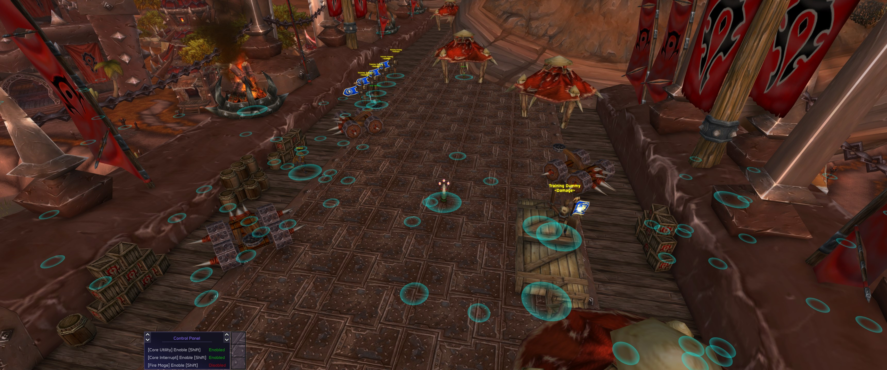
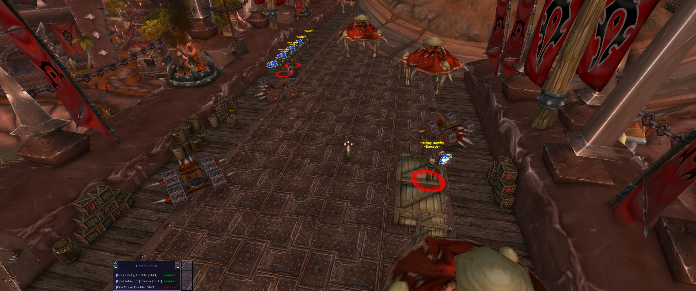
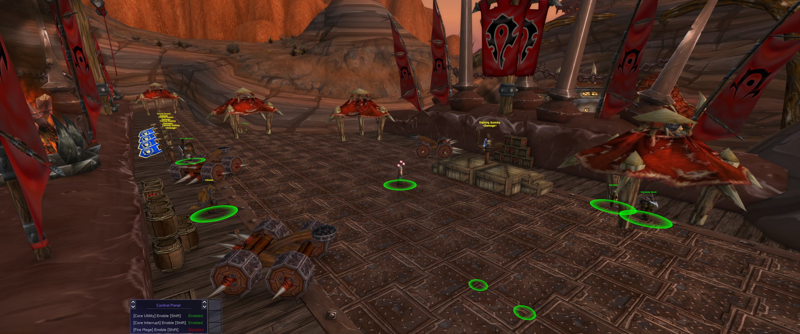

# Lua Object Manager

## Introduction

The Lua Object Manager module is your gateway to interacting with game objects in your scripts. While the core engine provides fundamental functions, we've developed additional tools to enhance your scripting capabilities and optimize performance. Let's explore how to leverage these features effectively!

## Raw Functions

### Local Player

### `core.object_manager.get_local_player() -> game_object`

- Retrieves the local player game_object.
- Returns: `game_object` - The local player game_object.

> **tip**: Always verify the local player object before use. Implement a guard clause in your callbacks to prevent errors and ensure safe execution. Remember, the local_player is a pointer (8 bytes) to the game memory object, which can become invalid. Check its existence before each use.

Example of a guard clause:

```lua
local function on_update()
    local local_player = core.object_manager.get_local_player()
    if not local_player then
        return -- Exit early if local_player is invalid
    end
    -- Your logic here, safely using local_player
end
```

This approach maintains code stability and prevents accessing invalid memory addresses.

### All Objects

### `core.object_manager.get_all_objects() -> table`

- Retrieves all game objects.
- Returns: `table` - A table containing all game_objects.

> **warning**: Use `get_all_objects()` and `get_visible_objects()` judiciously. These functions return a comprehensive list, including non-unit entities, which can be computationally expensive to process every frame.

For most scenarios, our custom `unit_helper` library (discussed later) is recommended for optimized performance and more relevant object lists.

> **tip**: New to scripting? Visualize objects with this example:

```lua
---@type color
local color = require("common/color")

core.register_on_render_callback(function()
    local all_objects = core.object_manager.get_all_objects()
    for _, object in ipairs(all_objects) do
        local current_object_position = object:get_position()
        core.graphics.circle_3d(current_object_position, 2.0, color.cyan(100), 30.0, 1.5)
    end
end)
```

Code breakdown:

1. Import the `color` module for color creation.
2. Register a function for frame rendering.
3. Retrieve all game objects.
4. Iterate through each object.
5. Get each object's position (returns a `vec3`).
6. Draw a 3D circle at each position:
   - Center: Object's position
   - Radius: 2.0 yards
   - Color: Cyan (alpha 100)
   - Thickness: 30.0 units
   - Fade factor: 1.5 (higher value = faster fade)

This visualization helps you grasp the scope of objects returned by `get_all_objects()`.



> **tip**: Want to dive deeper? Try accessing more object properties:

```lua
---@type enums
local enums = require("common/enums")

core.register_on_render_callback(function()
    local all_objects = core.object_manager.get_all_objects()
    for _, object in ipairs(all_objects) do
        local name = object:get_name()
        local health = object:get_health()
        local max_health = object:get_max_health()
        local position = object:get_position()
        local class_id = object:get_class()

        -- Convert class_id to a readable string
        local class_name = "Unknown"
        if class_id == enums.class_id.WARRIOR then
            class_name = "Warrior"
        elseif class_id == enums.class_id.WARLOCK then
            class_name = "Warlock"
        -- Add more class checks as needed
        end

        -- Log the information
        core.log(string.format("Name: %s, Class: %s, Health: %d/%d, Position: (%.2f, %.2f, %.2f)",
                            name, class_name, health, max_health, position.x, position.y, position.z))
    end
end)
```

This example showcases how to access various game object properties and use the `enums` module for interpreting class IDs. Feel free to expand on this for more complex visualizations or analysis tools!

### Visible Objects

> **warning**: ---- Not currently implemented ----

### `core.object_manager.get_visible_objects() -> table`

- Retrieves all visible game objects.
- Returns: `table` - A table containing all visible game_objects.

### Object From GUID

### `core.object_manager.get_object_from_guid(guid: string) -> game_object | nil`

- Retrieves the game object matching a GUID string, or `nil` if it is not currently present.
- Parameters: `guid` (`string`) - The unit GUID, as returned by `game_object:get_guid()`.
- Returns: `game_object | nil` - The matching game_object, or `nil` if not found.

## Unit Helper - Optimized Object Retrieval

To address performance concerns and provide targeted functionality, we've developed the `unit_helper` library. This toolkit offers optimized methods for retrieving specific types of game objects, utilizing caching and filtering for improved performance.

> **note**: To use the `unit_helper` module, include it in your script:

```lua
---@type unit_helper
local unit_helper = require("common/utility/unit_helper")
```

### Enemies Around

### `unit_helper:get_enemy_list_around(point: vec3, range: number, include_out_of_combat: boolean, include_blacklist: boolean) -> table`

- Retrieves a list of enemy units around a specified point.
- Returns: `table` - A table containing enemy game_objects.

Parameters:
- `point`: vec3 - The center point to search around.
- `range`: number - The radius (in yards) to search within.
- `include_out_of_combat`: boolean - If true, includes units not in combat.
- `include_blacklist`: boolean - If true, includes special units (use with caution).

Example usage:

```lua
---@type color
local color = require("common/color")
---@type unit_helper
local unit_helper = require("common/utility/unit_helper")

core.register_on_render_callback(function()
    local local_player = core.object_manager.get_local_player()
    if not local_player then
        return
    end

    local local_player_position = local_player:get_position()
    local range_to_check = 40.0 -- yards
    local enemies_around = unit_helper:get_enemy_list_around(local_player_position, range_to_check, false, false)

    for _, enemy in ipairs(enemies_around) do
        local enemy_position = enemy:get_position()
        core.graphics.circle_3d(enemy_position, 2.0, color.red(255), 30.0, 1.2)
    end
end)
```

This code visualizes enemies around the player with red circles, demonstrating the focused nature of `unit_helper` functions.



### Allies Around

### `unit_helper:get_ally_list_around(point: vec3, range: number, players_only: boolean, party_only: boolean) -> table`

- Retrieves a list of allied units around a specified point.
- Returns: `table` - A table containing allied game_objects.

Parameters:
- `point`: vec3 - The center point to search around.
- `range`: number - The radius (in yards) to search within.
- `players_only`: boolean - If true, only includes player characters.
- `party_only`: boolean - If true, only includes party members.

Example usage:

```lua
---@type color
local color = require("common/color")
---@type unit_helper
local unit_helper = require("common/utility/unit_helper")

local function my_on_render()
    local local_player = core.object_manager.get_local_player()
    if not local_player then
        return
    end

    local range_to_check = 40.0 -- yards
    local green_color = color.new(0, 255, 0, 230)
    local player_position = local_player:get_position()
    local allies_around = unit_helper:get_ally_list_around(player_position, range_to_check, false, false)

    for _, ally in ipairs(allies_around) do
        local ally_position = ally:get_position()
        core.graphics.circle_3d(ally_position, 2.0, green_color, 30.0, 1.5)
    end
end

core.register_on_render_callback(my_on_render)
```

Let's break down the optimizations in this code:

1. **Module Imports**: We import necessary modules for color and unit helper functions.
2. **Named Function**: We use a named function `my_on_render()` for better readability and debugging.
3. **Early Exit**: We implement a guard clause for the local player check.
4. **Pre-loop Calculations**: We define constants and calculate values outside the loop for efficiency.
5. **Optimized Retrieval**: We use `unit_helper:get_ally_list_around()` for targeted, efficient object retrieval.
6. **Efficient Looping**: We use `ipairs()` for optimal iteration.



## Performance Considerations

This code showcases several key performance optimizations:

1. **Color Calculation**: Pre-calculating the color object reduces redundant calculations.
2. **Player Position**: Calculating `player_position` once avoids repeated calls.
3. **Targeted Retrieval**: Using `unit_helper` functions significantly reduces processed objects.
4. **Efficient Looping**: Proper use of `ipairs()` ensures optimal iteration.

## Optimization Principles

Key principles demonstrated:

1. **Minimize Repetitive Calculations**: Perform constant calculations outside loops.
2. **Use Specialized Functions**: Employ targeted functions for efficient processing.
3. **Early Exit**: Use guard clauses to avoid unnecessary computations.
4. **Readability and Maintainability**: Balance optimizations with code clarity.

> **tip**: The `unit_helper` functions not only boost performance but also provide more relevant data for most scripting scenarios. By using these functions, you can create more efficient and focused scripts, reducing unnecessary iterations and checks.

Remember, effective scripting often involves balancing raw data access with optimized helper functions. As you develop more complex scripts, consider the performance implications of your choices and leverage the `unit_helper` library when appropriate. Happy scripting!

## More Object Manager Functions

### Mouse over Oject

### `object_manager.get_mouse_over_object() -> game_object`

Returns the object that you are hovering with your mouse.

### `get_arena_target(index: integer)`

Retrieves the game object associated with the given arena frame index. Returns `nil` if not in an arena.

Parameters:
- **`index`** (*integer*) — The arena frame index.

Returns: *game_object | nil* — The player corresponding to the arena frame, or `nil` if not available.

---

### `get_arena_frames()`

Retrieves the list of game objects representing all arena frames.

Returns: *game_object[]* — A list of all arena frame objects.

---

### `core.object_manager.get_party_frames`

```
core.object_manager.get_party_frames() -> game_object[]
```

Returns:
- `game_object[]`: An array of party frame game objects for `party1` through `party4`, excluding the local player.

Description: Returns party unit frame objects in frame order. The local player is not included.

**Example Usage**

```lua
local party_members = core.object_manager.get_party_frames()
for i, party_member in ipairs(party_members) do
    core.log("Party " .. i .. ": " .. party_member:get_name())
end
```

---

### `core.object_manager.get_arena_opponent_spec`

```
core.object_manager.get_arena_opponent_spec(index: integer) -> integer
```

**Parameters**
- `index`: `integer` - The arena opponent index.

Returns:
- `integer`: The specialization ID of the arena opponent. Returns 0 if unavailable.

Description: Returns the specialization ID of an arena opponent at the given index. Returns 0 if not in an arena or the opponent data is unavailable.

**Example Usage**

```lua
local spec_id = core.object_manager.get_arena_opponent_spec(1)
if spec_id ~= 0 then
    core.log("Opponent 1 spec ID: " .. spec_id)
end
```

---

### `core.object_manager.get_boss_frames`

```
core.object_manager.get_boss_frames() -> game_object[]
```

Returns:
- `game_object[]`: An array of boss game objects from boss unit frames.

Description: Returns the boss game objects from the boss unit frames.

**Example Usage**

```lua
local bosses = core.object_manager.get_boss_frames()
for i, boss in ipairs(bosses) do
    core.log("Boss " .. i .. ": " .. boss:get_name())
end
```

---

### `core.object_manager.get_boss_count`

```
core.object_manager.get_boss_count() -> integer
```

Returns:
- `integer`: The number of active boss unit frames (0-8).

Description: Returns the number of active boss unit frames, ranging from 0 to 8.

**Example Usage**

```lua
local boss_count = core.object_manager.get_boss_count()
core.log("Active bosses: " .. boss_count)
```

---

### `core.object_manager.get_all_missiles`

```
core.object_manager.get_all_missiles() -> missile[] | nil
```

Returns:
- `missile[] | nil`: An array of missile tables, or `nil` if there are no in-flight missiles.

Each missile table contains:

| Field | Type | Description |
|-------|------|-------------|
| `source` | `game_object \| nil` | The source object that fired the missile |
| `caster` | `game_object \| nil` | The caster object |
| `target` | `game_object \| nil` | The target object |
| `source_position` | `vec3` | The position where the missile was fired from |
| `current_position` | `vec3` | The missile's current position in the world |
| `impact_position` | `vec3` | The missile's destination/impact position |
| `spell_id` | `integer` | The spell ID of the missile |
| `speed` | `number` | The missile's travel speed |

Description: Returns all in-flight spell missiles (projectiles) currently in the world. This includes any visible spell projectile traveling from a caster to a target.

**Example Usage**

```lua
local missiles = core.object_manager.get_all_missiles()
if missiles then
    for _, m in ipairs(missiles) do
        local caster_name = m.caster and m.caster:get_name() or "unknown"
        core.log("Spell " .. m.spell_id .. " from " .. caster_name .. " at speed " .. m.speed)
        core.graphics.circle_3d(m.current_position, 0.5, color.red(200), 20, 1.0)
    end
end
```
