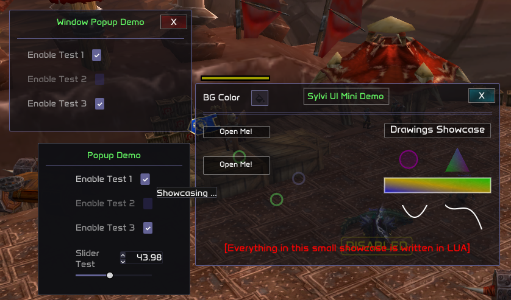
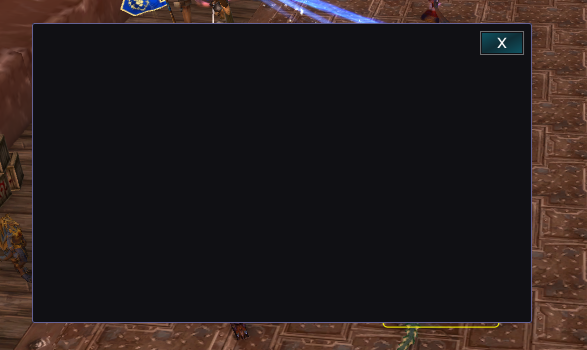
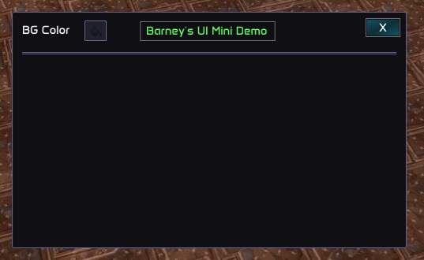
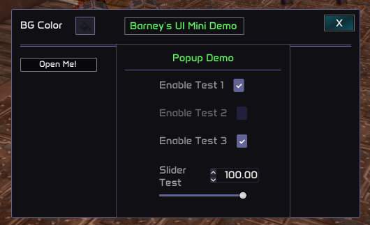
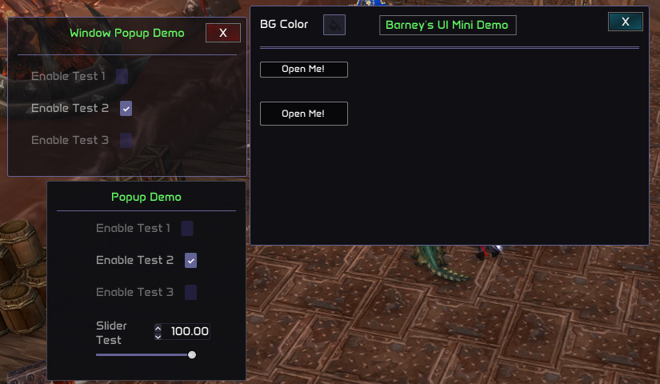

# Barney's Basic Guide (With examples) 🎯

## Overview

This guide attempts to guide our fellow Sylvanas programmers into building their own custom user interfaces for their plugins. For this, I have created a step-by-step guide basic that anyone with programming knowledge can follow **(hopefully, open to suggestions)**, adding multiple code examples and exercises to practise. The idea is to give you a starting point, so you can keep learning and evolving yourself afterwards.

## 🎯 Barney's Basic Guide 🎯

With this guide, our goal is to generate the following UI:



All the code that generates what we can see in the previous image will be extensively explained. The code is obviously open source for you to practise and be creative.

### Basics - 0

The basics - Getting Started

This module is located within the core.menu module. All our custom UI code will be rendered within a "Window". Each window is, and must be treated as, an independent object. Therefore, each individual window that we generate will have its own separate visuals and code. Before beginning, these are the modules that will be required:

```lua
---@type color
local color = require("common/color")

---@type vec2
local vec2 = require("common/geometry/vector_2")

---@type enums
local enums = require("common/enums")
```

### Basics - 1

The basics - Creating a Window Object

As previously stated, each window must be an individual object. So, same like with menu elements, we are going to generate a window as follows:

```lua
local test_window = core.menu.window("Test window")
-- Important: every window must have a unique identifier.
-- In this case, the identifier is "Test window".
```

Now that we already have our window object, we have to set its initial position and size. (This can be changed later, either by user input or by code, on the rendering callback, however, it's important to always set the initial position and size, which will be used as default.)

> **Note:** Size and position are of type vec2, since we need X and Y axis to define both magnitudes. See [vec2](/dev/api/vector-2)

**Case 1** - We don't want size or position to be saved after each injection:

We can just set the hardcoded position and size as follows:

```lua
local initial_size = vec2.new(200, 200)
window:set_initial_size(initial_size)

local initial_position = vec2.new(500, 500)
window:set_initial_position(initial_position)
```

**Case 2** - We want size or position to be saved after each injection:

In this case, we also have to generate "ghost" sliders that will save the last known value of position and size of the window, since menu elements are the only available resources that allows us to save information between different injections.

```lua
local window_position_elements = {
    x = core.menu.slider_int(0, 10000, 250, "test_window_x_initial_position"),
    y = core.menu.slider_int(0, 10000, 360, "test_window_y_initial_position"),
}

local window_size_elements = {
    x = core.menu.slider_int(0, 10000, 250, "test_window_x_initial_size"),
    y = core.menu.slider_int(0, 10000, 360, "test_window_y_initial_size"),
}
```

Now that we have our sliders defined (you can also use float sliders if you want more precision), we can actually set the window's initial size and position:

```lua
local initial_size = vec2.new(window_size_elements.x:get(), window_size_elements.y:get())
test_window:set_initial_size(initial_size)

local initial_position = vec2.new(window_position_elements.x:get(), window_position_elements.y:get())
test_window:set_initial_position(initial_position)
```

> **Note:** Everything that we used up to this point must be called OUTSIDE the render callback.

### Basics - 2

The basics - Rendering our First Window

Everything's ALMOST ready for us to render things and have fun. There is only one thing missing: we need to use the window's special rendering callback! We will use an anonymous function, so we can start rendering directly, but like with all other callbacks, you can define a function and then call the callback passing the said function.

```lua
core.register_on_render_window_callback(function()
end)
```

Now that we have our callback defined, let's actually start rendering. To render any window, we must use the window:begin function. This function's last parameter is another function, and from now on, almost all code will be placed inside this last function.

```lua
core.register_on_render_window_callback(function()
    -- Parameter 1: Resizing flags -> Accepts window_resizing_flags enum member:
    --   .NO_RESIZE or 0,
    --   .RESIZE_WIDTH,
    --   .RESIZE_HEIGHT,
    --   .RESIZE_BOTH_AXIS

    -- Parameter 2: Is adding cross -> Accepts Boolean. The cross refers to
    --   the top right X that when pressed will make the window invisible.
    --   If false, no cross will be rendered.

    -- Parameter 3: Background color -> Accepts Color
    -- Parameter 4: Border color -> Accepts Color

    -- Parameter 5: Cross style flag -> Accepts window_cross_visuals enum member:
    --   DEFAULT = 0, PURPLE_THEME = 1, GREEN_THEME = 2,
    --   RED_THEME = 3, BLUE_THEME = 4, NO_BACKGROUND = 5,
    --   ONLY_HITBOX = 6, NO_BORDER = 7,
    --   NO_BACKGROUND_AND_NO_BORDER = 8, NO_CROSS = 9

    -- NOTE: To use the default color, we need to pass color.new(0,0,0,0)

    test_window:begin(enums.window_enums.window_resizing_flags.RESIZE_BOTH_AXIS, true,
        color.new(0,0,0,0), color.new(0,0,0,0),
        enums.window_enums.window_cross_visuals.BLUE_THEME, function()
    end)
end)
```

### Basics - Last

The basics - Summary

As you can see, if we remove the comments, it's a pretty short and straightforward code. This is what we will be seeing on screen after we run this code:



### Intermediates - 1

The Intermediates - Rendering The Title

I am going to introduce the "dynamic" positions offsets, since this is something we need for our showcase. However, this is more advanced, and therefore will be explained in detail in the "The Advanceds" part of the guide.

If you go back to the first image, you can notice there is a color-picker on the top-left of the window. Yes, we can render menu elements inside our windows, so you will be able to make your own menus for your plugins, visual guides or whatever your imagination is capable of. First, we will create and render this color picker, since it's the first element that appears on the window.

```lua
-- note: this is a menu element declaration, so it must be outside of the callback function.
local color_picker_test = core.menu.colorpicker(bg_color, "color_picker_test_id_1")

test_window:add_menu_element_pos_offset(vec2.new(13, 13))
color_picker_test:render("BG Color")
test_window:add_menu_element_pos_offset(vec2.new(-3, -3))
```

Now, the colorpicker should be appearing on the top-left of the window. Let's move on to render the title:

```lua
local title_text = "Barney's UI Mini Demo"

-- With this function we get the exact X position offset required to add to the
-- current dynamic position so the text is in the center of the window:
local text_centered_x_pos = window:get_text_centered_x_pos(title_text)

-- We add the X position offset that we just calculated, and also we adjust the Y position:
window:add_menu_element_pos_offset(vec2.new(text_centered_x_pos, -32))

-- Finally, we just render the text on the dynamic position that we just set:
window:add_text_on_dynamic_pos(color.green_pale(255), title_text)
```

Now that we just rendered the title and the color picker, let's add something to highlight the title. For example, a rectangle:

```lua
window:render_rect(vec2.new(text_centered_x_pos - text_size.x / 20 - 3, 7.5),
    vec2.new(text_centered_x_pos + text_size.x * 1.05 - 1, 35),
    color.white(100), 0, 1.0)
```

And now we just have to add some separators:

```lua
window:add_separator(3.0, 3.0, 15.0, 0.0, color.new(100, 99, 150, 255))
window:add_separator(3.0, 3.0, 17.0, 0.0, color.new(100, 99, 150, 255))
```

This is how our window should be looking like in game with the current code:



### Intermediates - 2

The Intermediates - Popups

We can also spawn popups (or other windows) from our window. To do this, we obviously need something that triggers the event of the popup appearing. To achieve this, we will usually need buttons.

First, we need to define the button bounds, and then we just need to control the cursor positioning and behaviour.

```lua
-- top-left position of the button rect
local open_popup_rect_v1 = vec2.new(13, 70)
-- bot-right position of the button rect
local open_popup_rect_v2 = vec2.new(123, 90)

-- we can change alpha if the mouse is hovering our rect
local alpha = 120
if window:is_mouse_hovering_rect(open_popup_rect_v1, open_popup_rect_v2) then
    alpha = 255
end

-- background and borders of the rect
window:render_rect_filled(open_popup_rect_v1, open_popup_rect_v2, color.black(alpha), 1.0)
window:render_rect(open_popup_rect_v1, open_popup_rect_v2, color.white(alpha), 1.0, 1.0)
window:render_text(enums.window_enums.font_id.FONT_SMALL, vec2.new(40, 71), color.white(255), "Open Me!")

if window:is_rect_clicked(open_popup_rect_v1, open_popup_rect_v2) then
    is_popup_active = true
end
```

Note that popups are essentially windows too, the only difference is that they will be closed upon pressing outside of its bounds (or releasing the mouse, depending on the behaviour flag passed), so everything that we do inside its begin function is relative to the popup.

```lua
if is_popup_active then
    if window:begin_popup(color.new(16, 16, 20, 230), border_color, vec2.new(250, 250),
        vec2.new(150, 50), false, false, function()

        local popup_title_text = "Popup Demo"
        local popup_text_centered_x_pos = window:get_text_centered_x_pos(popup_title_text)
        window:add_menu_element_pos_offset(vec2.new(popup_text_centered_x_pos, 10))
        window:add_text_on_dynamic_pos(color.green_pale(255), popup_title_text)
        window:add_separator(3.0, 3.0, 5.0, 0.0, color.new(100, 99, 150, 255))

        window:add_menu_element_pos_offset(vec2.new(250/4, 5))
        window:begin_group(function()
            checkbox1:render("Enable Test 1", "Showcasing ...")
            checkbox2:render("Enable Test 2")
            checkbox3:render("Enable Test 3")
            slider_float_test:render("Slider\nTest")
        end)
    end) then
    else
        is_popup_active = false
    end
end
```

So far, this is what should be appearing on your screen after you hit the "Open Me!" button:



### Intermediates - 3

The Intermediates - Spawning Windows

This is pretty similar to what we did with the popups. The only difference is that now we need to create a window object and we need to handle its visibility in a different way, since windows by default don't close when pressing outside of its bounds.

First, we will generate the button that will trigger the window appearance, just like we did with the popup:

```lua
local open_window_rect_v1 = vec2.new(13, 120)
local open_window_rect_v2 = vec2.new(123, 150)

local alpha2 = 120
if window:is_mouse_hovering_rect(open_window_rect_v1, open_window_rect_v2) then
    alpha2 = 255
end

window:render_rect_filled(open_window_rect_v1, open_window_rect_v2, color.black(alpha2), 1.0)
window:render_rect(open_window_rect_v1, open_window_rect_v2, color.white(alpha2), 1.0, 1.0)
window:render_text(enums.window_enums.font_id.FONT_SMALL,
    vec2.new(open_window_rect_v1.x + 27, open_window_rect_v1.y + 7),
    color.white(255), "Open Me!")

if window:is_rect_clicked(open_window_rect_v1, open_window_rect_v2) then
    window_popup:set_visibility(true)
    is_window_popup_open = true
end
```

Now we just need to render this window:

```lua
if is_window_popup_open then
    window_popup:begin(enums.window_enums.window_resizing_flags.RESIZE_HEIGHT, true,
        color_picker_test:get(), border_color,
        enums.window_enums.window_cross_visuals.DEFAULT, function()

        local window_popup_title_text = "Window Popup Demo"
        local window_popup_text_centered_x_pos = window:get_text_centered_x_pos(window_popup_title_text)
        window:add_menu_element_pos_offset(vec2.new(window_popup_text_centered_x_pos, 10))
        window:add_text_on_dynamic_pos(color.green_pale(255), window_popup_title_text)
        window:add_separator(3.0, 3.0, 15.0, 0.0, color.new(100, 99, 150, 255))

        window:add_menu_element_pos_offset(vec2.new(30, 20))
        window:begin_group(function()
            checkbox1:render("Enable Test 1", "Tooltip Test ...")
            checkbox2:render("Enable Test 2")
            checkbox3:render("Enable Test 3")
        end)
    end)
else
    is_window_popup_open = false
end
```

### Intermediates - Last

The Intermediates - Summary

And this is what you should be seeing, after running this code in-game:



If you noticed, in the first image, on the right of the main window, there are some drawings that we haven't covered yet. Try to do that yourself as an exercise.

> **Tip:** You will need to use the following functions: window:render_circle_filled, window:render_circle, window:render_triangle_filled_multicolor, window:render_rect_filled_multicolor, window::render_bezier_quadratic, window:render_bezier_cubic, window:render_text.

### Advanceds - 1

The Advanceds - Animations

If you look closely at the first image, you will notice there are some random circles on the left. These circles are not static, but animated. You are more than welcome to do your own animations, but our windows provide a simple feature to animate widgets.

```lua
-- parameter 1: the id of the animation (integer)
-- parameter 2: the starting position of the animation (vec2)
-- parameter 3: the ending position of the animation (vec2)
-- parameter 4: the starting alpha of the animation (integer)
-- parameter 5: the ending (max alpha) of the animation (integer)
-- parameter 6: alpha speed (integer)
-- parameter 7: movement speed (integer)
-- parameter 8: animate only once (boolean)
local animation = window:animate_widget(1, vec2.new(0,0), vec2.new(50, 300), 0, 100, 100, 50, false)
local animation2 = window:animate_widget(2, vec2.new(0,0), vec2.new(180, 300), 0, 100, 80, 60, false)
local animation3 = window:animate_widget(3, vec2.new(0,0), vec2.new(210, 300), 0, 100, 100, 50, false)
local animation4 = window:animate_widget(4, vec2.new(300,0), vec2.new(50, 300), 0, 100, 105, 50, false)
```

The animation objects that we just created are returning a table. This table contains 2 elements:

1. current_position (vec2)
2. alpha (integer)

We are going to use these values to now draw our widgets accordingly:

```lua
window:render_circle(animation.current_position, 10.0, color.new(100, 99, 150, animation.alpha), 3.0)
window:render_circle(animation2.current_position, 10.0, color.green_pale(animation2.alpha), 3.0)
window:render_circle(animation3.current_position, 10.0, color.green_pale(animation3.alpha), 3.0)
window:render_circle(animation4.current_position, 10.0, color.new(100, 99, 150, animation3.alpha), 3.0)
```

And that's it. We now have some animated circles.

### Advanceds - 2

The Advanceds - Explaining Dynamic Drawing

So, there are 2 ways to draw stuff in a window:

**Statically:** This is very simple, since you are just basically hardcoding where you want to draw things, and they will be drawn there, not caring about other things that are currently being rendered in the window etc. (Note that all positions that you pass to the functions that draw statically are relative to the current window position, not the screen position.)

**Dynamically:** This is a little bit more complex to work with. Let's say there is an internal position variable. This variable's value is a vec2, and it changes according to the dynamic widgets that we render.

By using :add_menu_element_pos_offset, :get_current_context_dynamic_drawing_offset, :add_artificial_item_bounds you can achieve very interesting results.

> **Tip:** Check the "Panel Debug Target - Show Auras Info" to dive deeper into this matter and see some use examples.

"The basic guide ends here. I hope you are having fun creating some cool visuals so far! Check all the available code examples and all the individual functions documentation, with their code examples, and play with them. That's the best way to learn after all. Cya soon as a fellow developer :)"

Best regards, Barney
