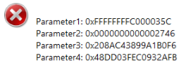
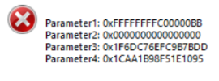
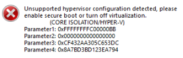
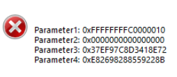
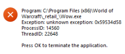
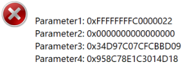
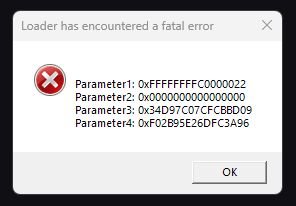
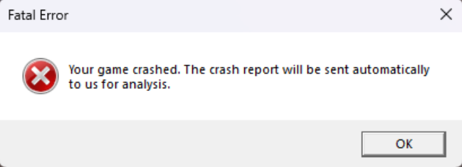
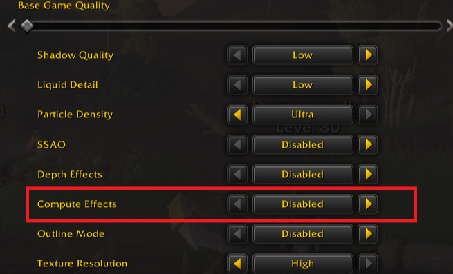
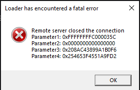

# Common Issues

## 🧭 Read This First

Most problems here take a few minutes to fix yourself, no staff needed. Skim for the error that matches yours before opening a ticket.

> **Warning**
> 
> Do not ask for account support in general chat. Open a ticket in `#support-tickets` and put your **Project Sylvanas web username** in the first message.

**Every ticket should include:**

- Your Project Sylvanas web username.
- What you need: crash, HWID reset, login, payment or subscription, phone HWID, or something else.
- A short, clear description of the problem.
- A screenshot of the exact error, if there is one.

**For a crash, also tell us:**

- The type: WoW closes, WoW freezes, the PS menu disappears while WoW keeps running, or it crashes during injection.
- When and how often: after how many minutes, which zone, which action, after alt-tabbing, in combat, and whether it is every time or only sometimes.
- Whether there is a WoW error, a PS error, a Windows message, or none.

**For an HWID reset**, include your username, a clear request, and a short reason. Resets are free unless abused, but they need manual review and usually take 12 to 24 hours. If you switch PCs often or get locked out a lot, set up [Phone HWID](/getting-started/phone-hwid-setup) instead. Phone Link is cheap (up to 1666 gold per month, about $1.60) and lets your phone verify it is still you, so you stop waiting on resets.

Tickets missing your username or the basic details take much longer.

## 🌐 Connection and Login

### Network Error

A network error is usually antivirus or firewall blocking the Sylvanas connection. Make sure neither is blocking it.

> **Note**
> 
> This is especially common in China. If you are there, a VPN or adjusted network settings often fixes connection stability.

## 🪟 Windows Configuration

### Disable Test Signing Mode

Test signing mode can interfere with Sylvanas. To turn it off:

- Open Command Prompt as Administrator.
- Run `bcdedit -set TESTSIGNING OFF`.
- Restart your computer.

### Enable Secure Boot or Disable Hyper-V

Sylvanas may misbehave if Hyper-V is on or Secure Boot is off. Pick one fix.

**Option 1: Disable Hyper-V**

- Open Command Prompt as Administrator.
- Run `bcdedit /set hypervisorlaunchtype off`.
- Restart your computer.

**Option 2: Enable Secure Boot**

- Restart into your BIOS or UEFI (usually F2, F10, or DEL during startup).
- Enable Secure Boot, save, and restart.

If it continues after either option, reach out on Discord.

### Unsupported Disk Configuration

RAID 0 and software-based drive emulation are not supported.

- On RAID 0, try AHCI mode in the BIOS and test again.
- On virtual drives or software RAID, disable them temporarily.
- Restart and try injecting again.
- If the error persists, open a ticket so we can investigate.

## 🛠️ Loader and Injection

### Loader Never Opens

- **Unblock the EXE:** right-click the loader `.exe`, open **Properties**, tick **Unblock** at the bottom, and click **OK**.
- **Close all WoW processes:** the loader cannot run alongside any `Wow.exe` (including `WowT.exe`, `WoWClassic.exe`, `WowProxy.exe`). Check Task Manager, and restart your PC if unsure.

### Loader Disappears or Crashes

Almost always caused by WoW running when you start the loader.

1. Close every WoW process first.
2. Launch the loader, log in, and inject.
3. Only after injection succeeds, open `wow.exe`.

Battle.net running is fine. What matters is that no WoW process is active.

### Loader Window Hidden or Disappearing

On some Windows versions the loader can go black or slip behind other windows, especially if you switch away before it attaches to the taskbar.

- Keep other windows closed or minimized when you launch it.
- Wait for it to fully load before touching another window.
- Click the loader once so it attaches to the taskbar.

### Antivirus Blocking Injection

Add the loader folder as an exclusion in Windows Security and try again. If it continues, fully disable or uninstall any third-party antivirus for testing (turning off only real-time protection is often not enough). Re-enable it afterward.

### WoW Running at a Different Privilege

This usually means a third-party tool (an old bypass or pixel bot) is changing how WoW starts. Open WoW normally and it should be fixed.

If you see this drive error instead, keep the loader and WoW files on the same physical disk.

## 💥 Crashes and Freezes

### My Game Crashes

Quick checks before a crash ticket:

- In Battle.net, select WoW, open its settings, and run **Scan and Repair**.
- If that does not help, try a clean WoW reinstall.
- Keep the loader folder out of protected locations like `Program Files`.
- Fully disable or uninstall third-party antivirus for testing if crashes continue.

**Regular crashes on a stable timer (every 10 to 15 minutes)** are almost always local and self-fixable:

- **Folder access:** keep the loader out of protected or admin-only paths, and off folders with unusual characters (Turkish, Arabic, and so on).
- **Antivirus:** some tools (Bitdefender is common) interfere even when whitelisted. Fully disable or uninstall for testing.
- **Graphics:** rare crashes come from GPU drivers or DirectX settings. Try **WoW > System > Graphics > Compatibility Settings**, or a clean driver reinstall.
- **Game files:** run Scan and Repair, and reinstall WoW cleanly if needed.

These affect fewer than 5% of users and stem from local setups, so they are documented here rather than fixed on our side.

**Random, event-triggered crashes** with no set interval are more likely in-game or a PS bug. Open a ticket in `#support-tickets` with your username and:

- The crash type: full crash (WoW closes), freeze (WoW stops responding), soft crash (menu disappears but WoW runs), or injection crash.
- How long you play before it happens, and whether it is tied to a zone, dungeon, battleground, class or spec, action, or alt-tabbing.
- Screenshots of any error.

### Game Freezes After Alt-Tabbing (DirectX Reset)

Alt-tabbing out and back can freeze the game, reset DirectX, and stop the cheat. Re-injecting after that usually crashes it. The reliable fix is a trusted NVIDIA registry change that disables Multi-Plane Overlay (MPO).

- Open the [NVIDIA fix guide](https://nvidia.custhelp.com/app/answers/detail/a_id/5157/~/after-updating-to-nvidia-game-ready-driver-461.09-or-newer%2C-some-desktop-apps) and download its registry macro.
- Run the macro to disable MPO, then restart your PC.
- The same guide has a second macro that undoes the change if needed.

If it persists, try disabling G-Sync too.

### Game Freezes While Playing

Mid-game freezes can come from the Windows Game Bar.

1. Open **Settings > Gaming > Game Bar** and turn it off.
2. Restart your PC.

This often logs a repeated Event Viewer error about `Windows.Media.Capture.Internal.AppCaptureShell` timing out. If freezes persist, check Event Viewer and open a ticket with the details.

### Zone-Specific Crash (In-Game Only)

If WoW crashes in certain zones but runs fine elsewhere or at character select:

1. Uninstall your GPU drivers completely with [DDU](https://www.guru3d.com/download/display-driver-uninstaller-download/).
2. Restart your computer.
3. Reinstall the latest GPU drivers ([NVIDIA](https://www.nvidia.com/en-us/drivers/) or [AMD](https://www.amd.com/en/support/download/drivers.html)).
4. In **WoW > Settings > Graphics**, find **Compute Effects** and set it to **Disabled**.

If you still crash outside specific zones, the cause may be unrelated, so open a ticket.

## 🎛️ In-Game and Overlay

### Invisible Cursor on Menu

The cursor can go invisible in the PS menu, usually from certain WoW settings (joystick-related ones are a frequent culprit). Some WoW settings permanently change behavior even after you revert them, so a full settings reset is often the only fix.

1. **Back up your settings:** in your WoW install, copy the **WTF** folder somewhere safe.
2. **Reset:** delete the **WTF** folder to restore default settings.
3. **Test:** launch WoW and check if the cursor is back.
4. **Restore gradually:** bring settings back from your backup a few at a time to find a comfortable config without the bug. Leave joystick settings off.

### Plugin Load Failure (Missing or Broken Plugin)

The loader tried to load a plugin that does not exist or is broken.

- Open a ticket on Discord.
- Tell us which plugins you have loaded and when the error appeared.

It can happen if a plugin was removed, renamed, or misconfigured, and sometimes it is a core plugin you cannot skip. It is rare but serious, so report it quickly.

### In-Game Issue or Missing Feature

If a rotation is off, a spell is not casting right, or a feature seems missing (an auto stealth toggle, a visual indicator, and so on), report it.

- Open a thread in **#report-issues** on Discord.
- Describe what happens versus what you expected, and which spell or feature is involved.

There is no downside to reporting. Worst case, we point you to something you missed. We keep reports open until the feature already exists, the issue turns out not to be real, or the fix is confirmed working.

---

If none of these fix your issue, open a ticket on Discord and we will be happy to help.
