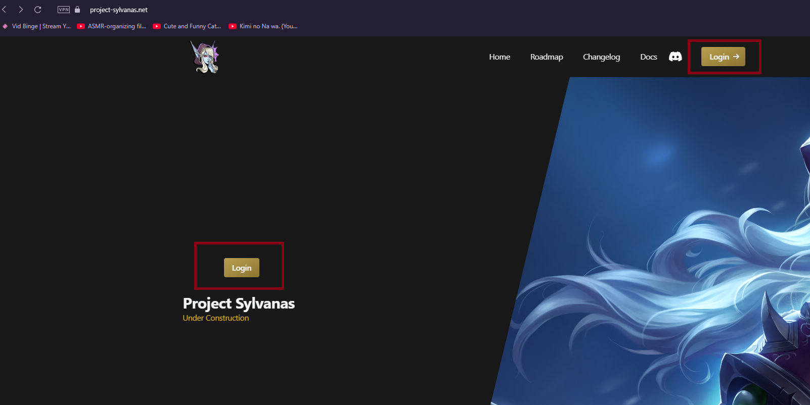
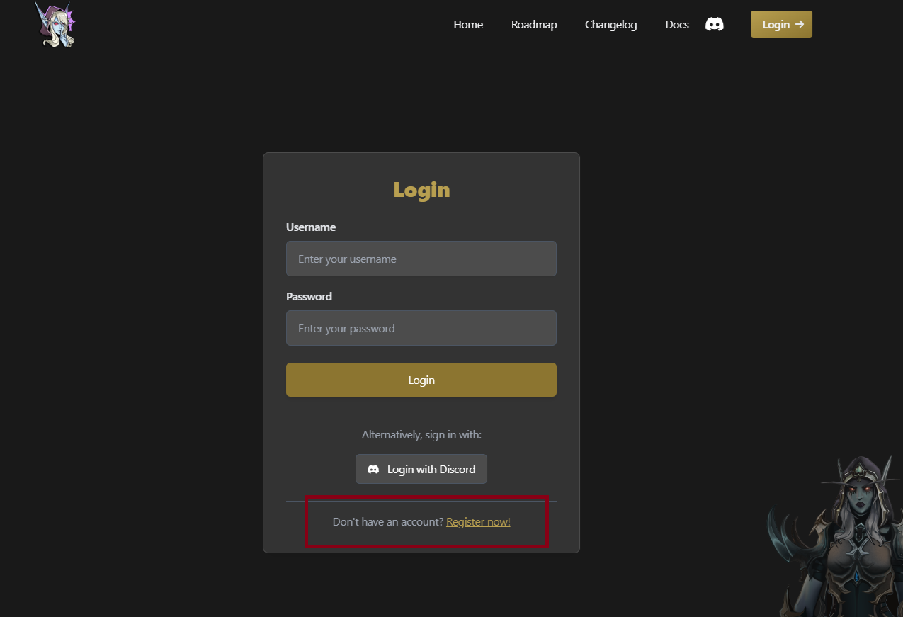
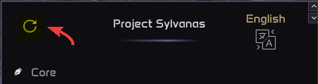
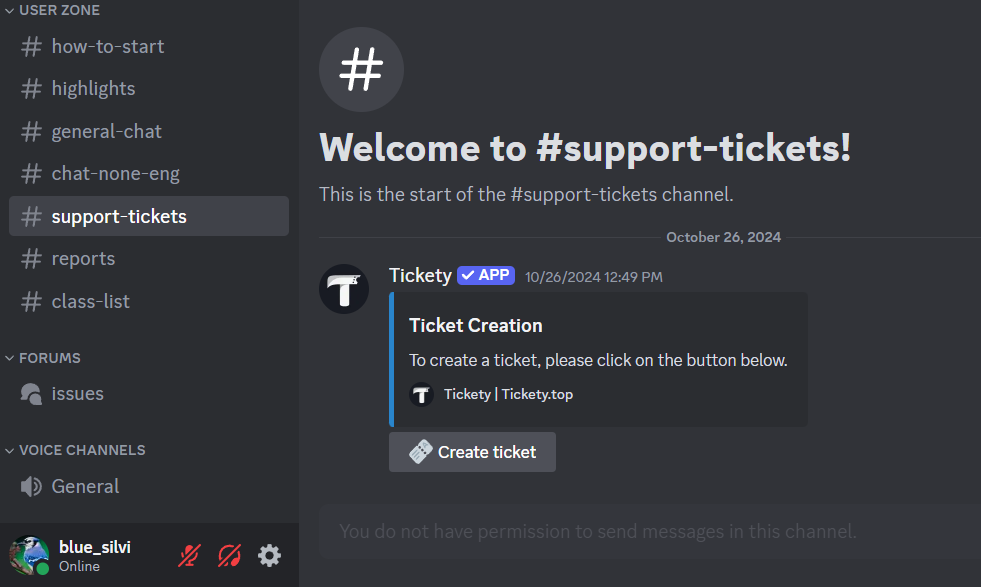
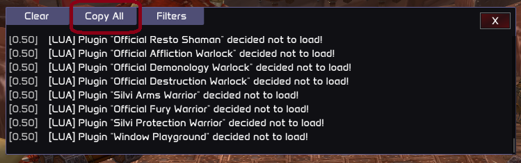

# Introduction

## Overview

In this document, you will learn how to setup and begin playing with Sylvanas. It's a very simple procedure, but we will try to explain everything thoroughfully.

## Welcome Letter

First of all, thanks for choosing Sylvanas. We know that our unique approach might be scary at first and appreciate those adventurers who deposit their trust on us. We have invested a lot of time and passion in this project and we want to make it as close to perfection as possible. Of course, we know that this is a long way, but with your feedback we are confident we will get there very soon, since we have all the tools required for it. You are also welcome to become a Lua developer here with us! Check [Getting Started - Developers](https://docs.project-sylvanas.net/dev)

Without further ado, let's begin playing with Sylvanas 🫶

> **Note**
> 
> - Supported OS: Windows 10 1909 to Windows 11 25h2
> - Supported DX version: 12 (In WoW Settings, navigate to System -> Graphics -> Graphics API -> Set to DirectX 12)

## Step 1: Register on the Website

Head over to our official [website](https://project-sylvanas.net) and create an account. To create an account, press the login button and in the new page, press Create Account:

- Press the Login button

    

- Press the "Register Now!" button

    

- Finally, just enter your new username and password, verify the captcha and click the Register button.

## Step 2: Get Gold

To fully enjoy the Sylvanas experience, you need to acquire **Gold**, our in-game currency that unlocks subscriptions and additional features. There are two ways to purchase Gold:

All Gold purchasing is handled on the dedicated page:
[How To Get Gold](https://docs.project-sylvanas.net/getting-started/how-to-get-gold)

> **Note**
> 
> If you encounter any issues during the purchasing process, feel free to open a ticket on our Discord server for support.

## Step 3: Manage Plugins

Sylvanas plugins live in two places:

1. **Plugin Marketplace**

   - Link: [https://project-sylvanas.net/panel/plugins/marketplace](https://project-sylvanas.net/panel/plugins/marketplace)
   - Browse all available plugins (free and paid).
   - Click **Buy** (even free plugins cost "0 Gold") to add them to your **Plugin Library**—this ensures every plugin can be monetized or updated consistently.

2. **Plugin Library**

   - Link: [https://project-sylvanas.net/panel/plugins/library](https://project-sylvanas.net/panel/plugins/library)
   - Toggle any purchased plugins **On** or **Off** at will.
   - To apply changes in-game, click the **Refresh** button in the top-left of the Sylvanas menu.

> **Sync & Updates:**
> 
> - Every time you **inject** Sylvanas, your library automatically syncs:
>   - Adds newly enabled plugins into WoW.
>   - Removes plugins you've disabled on the website.
>   - Fetches any plugin updates.
> - Manual refresh in-game is only needed if you change your library mid-session and want to apply those changes without reinjecting.

> **Note**
> 
> This is where the reload button is ingame 

## Step 4: Download Your Personal Loader

- Navigate to [https://project-sylvanas.net/panel/loader](https://project-sylvanas.net/panel/loader)
- Click **Download**. The server will generate a **unique** ZIP for your account.
- You'll see a ZIP password on that page (currently **wow2025**, but this may change).

Download the loader and execute it in the location where you want your Sylvanas files to be stored. The loader will automatically download and generate necessary files, including scripts and other resources.

> **Note**
> 
> Create a folder to store the loader, don't throw it on the Desktop, and open it from there directly because all the files like the Lua scripts that the loader will automatically download will be spread throughout your Desktop. (It's not like you are not allowed to do this, it's just a recommendation)

### Unblock the Loader (If Needed)

If Windows or your antivirus flags the loader:

- Right-click the `Loader.exe` → **Properties**
  - Keep in mind your loader wont be named Loader.exe, it will probably have a random name like 86484e88807d0b9c.exe
- On the **General** tab, look for **"This file came from another computer and might be blocked…"**
- Check **Unblock** and click **OK**.

## Step 5: Run & Inject

1. **Run** the loader **before** opening WoW.
   - On your **first run**, one of two things may happen:
     - **Success:** Loader opens smoothly and you see the login form.
     - **Error:** An alert appears—refer to [Common Issues](https://docs.project-sylvanas.net/docs/common-issues) or open a Discord ticket if it's not listed.

2. In the loader window, enter your website **Username** and **Password**, then click **Login**.
3. Choose your desired version (or leave on **Automatic**), then click **Inject**.
4. Launch `wow.exe`—Sylvanas will already be injected and ready to play.

> **Tip**
> 
> You don't need to close Battle.net or the WoW launcher—just ensure `wow.exe` isn't running when you hit **Inject**, and you'll be good to go.

## Step 6 (Optional): Join the Discord Server

Once registered:

- Click the Discord icon on our site (top-right) or go to [https://discord.gg/SDe3ze5bPx](https://discord.gg/SDe3ze5bPx)

> **Tip**
> 
> Open a ticket if you find any issue or you want to get a free trial before purchase

## In-Game Controls

When in-game, you can manage Sylvanas with these keys:

- Press `F6` to reload scripts.
- Use `INSERT` to open and close the main menu.
- Use `DELETE` to open and close the console.

> **Note**
> 
> The console also has a handy "Copy All" button—great for sending Lua error logs to us via Discord tickets or direct messages. 

## Enjoy playing!

We hope you enjoy Sylvanas as much as we enjoy working on it!

> **Tip**
> 
> Continue reading the following user pages for tips and tricks to learn and configure Sylvanas faster 🕺
