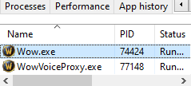

# Multi-Session Setup

## Overview

Sylvanas supports **multi-session injection**, allowing you to run multiple World of Warcraft clients with independent Lua environments. This is especially useful for **multiboxing**, or setting up **multi-client gold or experience farming** setups.

✅ **Good news**: There's no limit to how many sessions you can run, as long as you're using the **same PC and HWID**. This functionality is currently **free of charge**, but please note that it may become a **premium feature** in the future.

⚠️ The limit and price is subject to change once the feature becomes a **paid add-on** in the future.

## Step 1: Prepare Multiple Loader Folders

Each session **must** have its **own loader folder**. This is essential to prevent conflicts or corruption in your Lua license file and downloaded scripts.

> 📌 Tip: You can simply copy your existing loader folder and paste it somewhere else (e.g., `Loader1`, `Loader2`, etc.)

## Step 2: Get the Game PID

Before injecting, you need to find the **PID** (Process ID) of each WoW client.

- Open **Task Manager**
- Go to the **Details** tab
- Look for `wow.exe`
- Note the **PID** (e.g., `8244`, `9408`, etc.)



## Step 3: Inject Into Each Session

Open **Command Prompt as Administrator**, then move it into the loader folder you want to use.

1. Open the loader folder in File Explorer.
2. Click the address bar and copy the full folder path.
3. Press `Start`, type `cmd`, right-click it, and choose **Run as administrator**.
4. In Command Prompt, run `cd /d` followed by your loader folder path.

Example:

```
cd /d "C:\Users\YourName\Desktop\Loader1"
```

Your prompt should now show your loader folder, not `C:\Windows\System32`.

Then, for each WoW session, run the loader from that folder and replace `<gamepid>` with the actual PID:

```
loader_name.exe --auto-inject --pid=<gamepid>
```

**Example**

```
9w923jms3oi.exe --auto-inject --pid=8244
```

Each loader instance will attach Sylvanas to its assigned game window.

> **Warning**
> 
> **Important:** Run the command from the correct loader folder. If Command Prompt is still in `C:\Windows\System32`, Windows will not know where your loader file is.

## Tips & Notes

🧠 **Make sure** each loader is from a different folder. Sharing one folder across sessions will **break** the Lua environment.

🛑 Don't try to inject twice into the same PID—it won't work and may freeze the client.

📁 If you see an error like `"loader_name.exe" is not recognized`, you are probably in the wrong folder or using the wrong loader file name.

🧪 This feature is in **open access** for now. Eventually, it will require a **separate paid add-on**, but we are keeping it unlimited during this testing phase.

## 🎮 Happy Multi-Boxing!

We hope you enjoy exploring all the possibilities with multi-session support. As always, if you run into any issues, hop into our [Discord](https://discord.gg/SDe3ze5bPx) and open a ticket for help.

> 💡 Want to automate some behaviors across clients? Check out the Lua API and plugin features available in your session.
