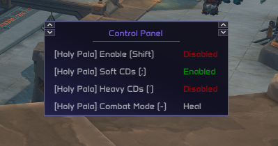

# Control Panel

## Overview

The `control_panel` module is essentially a separate unique graphical window that allows you to track and easily modify the state of specific menu elements whose values are of special importance or are designed to be modified constantly, so the you don't have to open the main menu every time. This is usually how the Control Panel might look like for an average user:

> **Note**
> 
> Is up to the script developer to enable each menu element's control panel support. It is also up to the developer to enable the Drag & Drop functionality for menu elements, so if you see it's not working for you and you feel like it should, contact the script that you are using's developer.

> **Tip**
> 
> You can interact with the elements inside the Control Panel by clicking on them.

## How it Works - Basic Explanation

### Control Panel Behaviour Explanation

As you can see in the previous video, you can remove and add elements from the Control Panel manually. There are 2 ways to do this:

1. The menu element was dragged and dropped: In this case, you can remove the element from the Control Panel by double-clicking with the right-mouse button on its hitbox.

2. The menu element keybind was set: you can also make the menu elements appear just by changing the keybind to another key different than the "Unbinded" one. In the same way, a user can remove an element from the Control Panel by setting its key value to "Unbinded" again.

> **Note**
> 
> To drag a menu element that has Drag & Drop enabled, you have to press SHIFT and then click. When the Drag & Drop is ready, you will see a box with the menu element name appear. Then, you can drag the said box to the Control Panel. When the Control Panel is highlighted in green, you can drop the box there. After that, you will see that the menu element is now successfully binded to the Control Panel.

> **Warning**
> 
> If a menu element was dragged and dropped in the Control Panel, setting its value to "Unbinded" won't remove it from the Control Panel. Instead, RMB double-click is mandatory.
> 
> Likewise, if a menu element was introduced to the Control Panel by setting its value to one different than "Unbinded", RMB double-click won't remove it from the Control Panel.
