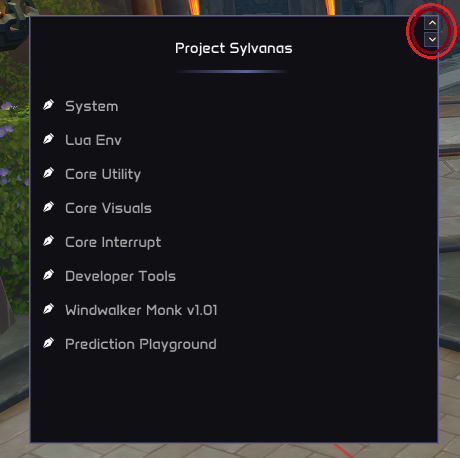
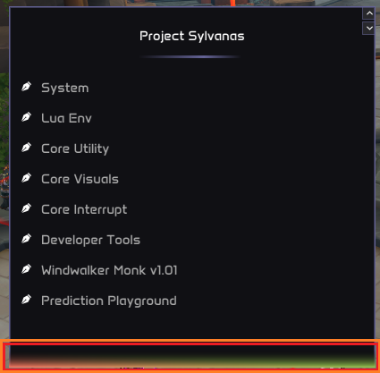
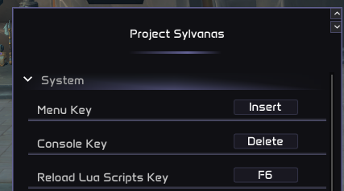

# Menu

## Overview

The main menu is one of the first things you will see upon injecting. This is where you will find all customization options for your scripts. Although the menu elements themselves are pretty intuitive, there are some perks that you should know, covered below in this small user guide.

# Functionality Perks

## 1 - Size Modifiers

#### Width Modifier:

You have the option to increase or decrease the width of the menu with the arrows situated at the top-right of the menu. Width has fixed values to preserve style.

#### Height Modifier:

You also have the option to increase or decrease the height of the menu. To do so, you just have to place your cursor over the bottom of the menu. You will see that a multi-color rectangle will appear. After that, you just have to click and drag the cursor in the direction you want the menu to grow.

## 2 - Menu Elements Perks

### 2.1 - Default-State Reset

All menu elements have a default value. This value is specified by the developer, and it should usually be the value that fits the best in most situations. In other words, the value that is best in general, but not necessarily in all cases. Our menu elements offer the option to reset their current state to the default one by right-clicking on them.

### 2.2 - Sliders Text Input

All sliders allow you to manually input the value. To do so, you just have to CTRL+Click on the slider bounds.

> **Note**
> 
> If you introduce a value superior to the max possible value specified by the developer for the slider, the value will be automatically set to this maximum value. The same happens for values inferior to the min possible value.

## 3 - Keybinds

There are 3 special keybinds that you need to take into account. These are:

1. Menu Key (default value: Insert) -> This keybind toggles the menu visibility.
2. Console Key (default value: Delete) -> This keybind toggles the console visibility.
3. Reload Lua Scripts Key (default value: F6) -> When this keybind is pressed, all LUA scripts are reloaded. It will also search for new scripts and load them, if they were not loaded.

All these keybinds can be customized. You can find them under the "System" sub-menu:

