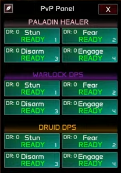

# PvP Panel (CC Panel)

## Overview

The **PvP Panel** (also called the **CC Panel**) is one of the most important and user-friendly modules in Sylvanas. While fully optional, this panel unlocks **next-level control** over your **crowd control (CC)** strategy in PvP.

Unlike most rotations that aim to automate everything, **CCs are more about *when* you press them, rather than *how fast***—timing is everything. The PvP Panel gives you that **perfect control** without making CC a chore.

## Visual Examples:

DR: 0 means the crowd control (CC) will be 100% effective. By default, the panel will not apply CC above DR 0 and will wait until it resets. However, you can change this setting, and it's recommended for classes that use frequent CC, like a Druid chaining Cyclone twice on the same target. In that case, set "No DR" to "Allow DR1" so it works properly.

The number in the bottom-right corner of each button (1, 2, 3, 4) shows its position. For example, on the Paladin Healer section, "Stun" is button 1-1, meaning first button of the first unit. You can bind 1-1 to a key (like L) so pressing it will automatically cast the stun when possible, or wait for the right timing if needed. If the button turns red, it means it's in progress, so you can focus on something else.

Healers always appear first in the panel. In battlegrounds or arenas, this ensures all healers are listed on top. If no healer is present, the order becomes random, but as soon as a healer appears, they move to the first position. This helps you quickly orient yourself during combat.

Why does it stay red for a while? Because the objective is already in CC from stormbolt earlier, so its waiting until the current CC is about to end before applying then new desired CC.

Same here, waiting for the trap to be near the end before starting Cyclone.

## 1 - What is the PvP Panel?

The **PvP Panel** appears as an on-screen interface containing customizable buttons, each mapped to a specific CC spell (stuns, fears. traps, etc.). You can **click them manually** or assign **keybinds** for faster access. Once triggered, the system handles the rest—**smart conditions, checks, and chaining logic** are already built-in.

You can freely **hide or reopen** the panel at any time through the plugin settings.

## 2 - Why Manual, If It's Smart?

This is not just a button that casts your CC blindly. Behind every click, there are **dozens of automated safety checks**:

- Does the target have **DR (Diminishing Returns)**? If yes, it may **wait for the DR to reset** to maximize CC value.
- Is the enemy in another CC already? The system can **chain CCs** automatically when the current one is about to expire.
- Is the target under **immunity, grounding, or reflect**? The panel will **wait until it's safe** to cast.
- Is your CC the **best choice in this situation**? If another enemy is near death, the logic might let the CC go through anyway.

The **manual part is just the *decision of when***. Everything else—execution, safety, timing, chaining—is handled **for you**.

> **Tip**
> 
> Think of it as calling the shot, while Sylvanas takes care of everything else. One click = perfect execution.

## 3 - Smart Chaining and DR Logic

Let's say you want to **stun the healer**:

- If the healer is **already blinded or trapped**, your CC will **not fire early**.
- It will **wait** and **chain** your CC at the **last possible moment** to maximize uptime.
- If **Grounding Totem** or **Reflect** is active, it will wait for them to **expire or be baited**.
- You can customize whether to **ignore DR** entirely, or allow **exceptions** (e.g., "cast anyway if we can secure a kill").

This is why we say it's not a dumb button. It's smarter CC—**with your timing, not guesswork**.

## 4 - Customization and Keybinds

Each button on the PvP Panel is fully configurable:

- Assign **keybinds** for faster access.
- Control **DR behavior**, **prioritization**, and **special conditions**.
- Enable or disable **chaining**, **pre-checks**, or **DR safety** individually.

> **Note**
> 
> These settings should be inside the rotation menu, depends on which rotation / plugin you are using. PvP Panel unlike other core features its based on the rotation itself.

## Why This Matters

In high-rated PvP, **control wins games**. The difference between a good CC and a game-winning one is often just **better timing**.

With the **PvP Panel**, you don't need to micro-manage targeting or spell conditions—you just need to make the call. **Sylvanas will deliver the perfect CC, at the perfect time.**

You get the power of scripting, with the intelligence of automation, **without losing control**.

## TL;DR:

- Optional panel to make CC **easier and smarter**.
- Fully supports **keybinds, chaining, DR logic, and trap protection**.
- The CC doesn't fire blindly—it waits for the **optimal moment**.
- You press it when you want—**everything else is automatic**.
- Built for serious PvP players who value **timing over spamming**.

> **Tip**
> 
> CC like a pro, with just one click. Smart logic. No stress.
