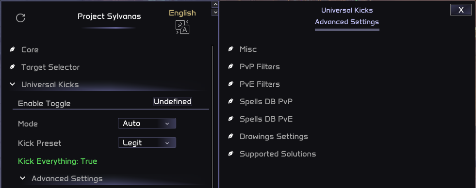
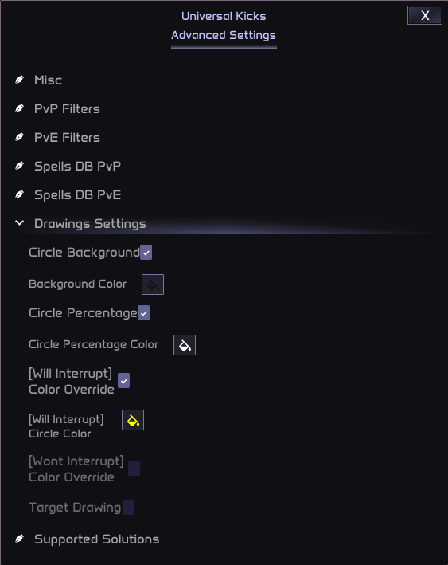

# Universal Kicks

## Overview

The **Universal Kicks** module in Sylvanas is a powerful tool designed to support and manage all possible interrupt spells across every class and talent configuration in the game. These interrupt spells, which we refer to as **Solutions**, are applied to enemy spell casts in both **PvP** and **PvE** environments. The module utilizes a centralized spell database, ensuring that the correct solution is applied based on the scenario.

To configure the Universal Kicks settings, you can access the menu here: **Main Menu -> Universal Kicks**.

## 1 - PvP and PvE Spell Database

The **Universal Kicks** module includes a comprehensive spell database that is organized by caster class for **PvP** spells, and by season for **PvE** spells. This database allows the module to know exactly what spells should be interrupted and when, based on the type of content you are engaging with.

To view the spells database menu options:
**Main Menu -> Universal Kicks -> Advanced Settings -> Spells DB**

### Smart Filters for PvP and PvE

The **Universal Kicks** module supports **Smart Filters**, which allow you to set different conditions for interrupting spells in **PvP** versus **PvE**. For example:

- In **PvP**, you might want to interrupt a heal only if the target being healed has **less than 70% health**.
- In **PvE**, you might prefer the default behavior of interrupting heals when the target is at **100% health**.

This ensures that your interrupts are more strategically timed based on the specific scenario. You can fine-tune these filters in the settings menu, allowing for a tailored experience in different content types.

> **Note**
> 
> The smart filters are found in the "PvP Filters" sub-menu, for PvP spells, and in the "PvE Filters" sub-menu, for PvE spells.

## 2 - Supported Solutions

The **Universal Kicks** module supports a wide variety of solutions for each class. For instance, for **Death Knights**, the module supports interrupts such as:

- **Death Grip**
- **Asphyxiate** (includes **Strangulate** as a PvP talent)
- **Mind Freeze**
- **Blinding Sleet** (includes multi hit logic)
- **Pet Gnaw (Stun)** (includes **Jump** gapcloser logic)

These solutions cover both **single target** and **area interrupts**, ensuring flexibility across different encounter types, especially in **dungeons** and **raids**.

You can access the **Supported Solutions** menu here:
**Main Menu -> Universal Kicks -> Advanced Settings -> Supported Solutions**.

> **Note**
> 
> While we strive to include all relevant interrupt solutions, **new spells or talents may be added** in future patches or versions of WoW. If you notice any missing solutions or errors, feel free to **report** them so we can work on improving the module.

### Area-Based Interrupts

For **PvE** content, the module attempts to apply area-based solutions that can interrupt multiple spells simultaneously, though this can be tricky. We continuously work on improving these solutions for high-end content, but certain complex encounters may still require **manual intervention**.

This module is designed to help players easily navigate high-end content, but for the absolute highest tiers, such as **Mythic 10+ keys** or **high arena ratings**, you may need to do some **manual adjustments** for optimal performance.

## 3 - Advanced Settings

### Keybinds and Randomization

You can configure **keybinds** to disable the **Universal Kicks** module when you do not want it to be active. **By default**, the module will attempt to interrupt casts regardless of whether you are actively playing or AFK.

In the **Advanced Settings**, you can also customize the percentage at which the interrupt will trigger. **By default**, interrupts are set to trigger near the end of the cast, with a randomized window to make the behavior less predictable, so nobody can determine that you are using scripts by seeing that you always interrupt at the exact same cast percentage, and also giving a more natural feel.

### Drawing Settings

The **Universal Kicks** module includes a visual aid system that displays **circles** around enemy casters during spell casts. These circles act as a progress bar, showing the time remaining before the spell is cast. The visual indicators follow these colors:

- **White**: The spell is detected, but no solution is currently available.
- **Yellow**: A solution is planned but will only be applied when the interrupt percentage condition is met.
- **Green**: The interrupt has been sent to the game server and will stop the spell.

You can **customize** these visual settings in the menu:

## 4 - Limitations and Future Improvements

The **Universal Kicks** module is already highly effective for most content, but we acknowledge that it may not always provide perfect results in the highest levels of play (e.g., **Mythic 10+ keys** or **high-rated arenas**). Further improvements to the module are possible, but as a project, we must prioritize our time across various areas.

We will continue to collect feedback and work on enhancements, though our current focus remains on broader updates, such as new rotations and support for additional WoW versions.

> **Note**
> 
> Please feel free to report any issues or suggest improvements, and we will work to refine the module when time allows.
