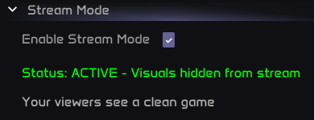

# Stream Mode

This guide explains how to use Stream Mode to hide PS visuals from your stream or recordings while keeping them visible on your screen.

## Overview

By default, PS renders its visuals (circles, lines, ESP, etc.) directly in the game. This means **streaming software like OBS will capture these drawings** and show them to your viewers.

**Stream Mode** solves this by moving all PS rendering to a special overlay layer that renders **after** OBS captures the frame. The result:

- ✅ You see all PS visuals on your screen
- ✅ Your stream/recording shows a clean game without any PS drawings

### Demo

*This is stream PoV, you can still see drawings while playing*

**IMPORTANT - Start Stream AFTER Injection**

**Always inject PS and wait for it to fully load BEFORE starting your stream.**

During PS initialization, visuals may briefly be visible to capture software. We are not responsible for any drawings that appear on stream during the injection/loading process.

**Safe order:**

1. Inject PS
2. Wait for PS to fully load
3. Enable Stream Mode
4. Verify status shows "ACTIVE"
5. THEN start your stream

---

## Supported Software

**OBS Only**

**Stream Mode only officially supports OBS (Open Broadcaster Software).**

We intercept the OBS capture hook specifically. For maintainability reasons, we cannot support every capture software out there - there are simply too many, and each works differently depending on your hardware and settings.

| Software | Supported | Notes |
|----------|-----------|-------|
| **OBS Studio** | ✅ Yes | Officially supported |
| **Discord** | ❌ No | Use OBS Virtual Camera workaround (see below) |
| **Medal** | ❌ No | May work if it uses OBS-style capture |
| **WoW Recorder** | ❌ No | May work if it uses OBS-style capture |
| **Other apps** | ❌ No | May work - test on your PC |

**Why other apps aren't supported:** Different software captures frames in different ways. Some capture internally (inside the game), others capture externally (from your desktop/GPU output). PS draws inside the game and can only bypass captures that happen inside the game - we render after the internal capture is done. External captures (like Discord's DX12 desktop capture) happen outside the game where we have no control.

---

## Streaming with OBS

OBS is the officially supported streaming/recording software.

### Setup:

1. **Enable Stream Mode** in PS menu
2. **Open OBS**
3. **Add a Game Capture source:**
   - Click **+** in Sources
   - Select **Game Capture**
   - Choose **Wow.exe** or **WowClassic.exe**
4. **Start streaming or recording**

Your stream will show a clean game without PS visuals.

---

## Streaming with Discord

**Discord Does NOT Work By Default**

**Discord screen share will NOT hide PS visuals**, even with Stream Mode enabled.

Discord captures frames externally (especially on DX12), which we cannot intercept. You **must** use the OBS Virtual Camera workaround below.

### The OBS Virtual Camera Workaround

To stream on Discord with hidden PS visuals, you need to use OBS as a middleman.

### Step-by-Step:

1. **Set up OBS first** (see OBS section above)
   - Add Game Capture for WoW
   - Make sure your OBS preview shows the game

   > **Game Capture** - **Not WINDOW CAPTURE**

2. **Start OBS Virtual Camera:**
   - In OBS, click **Start Virtual Camera** (bottom right corner)
   - This creates a fake webcam that outputs whatever OBS sees

3. **Share on Discord:**
   - Join a Discord voice channel
   - Click **Share Your Screen**
   - Select the **3rd tab: "Devices"** (not Window or Screen)
   - Choose **OBS Virtual Camera**
   - Click **Go Live**

4. **Done!** Your Discord stream now shows OBS output with hidden PS visuals.

### Discord Streaming Tips:

- Keep OBS running in the background the entire time
- You don't need to actually stream to Twitch/YouTube - just use Virtual Camera
- If OBS Virtual Camera doesn't appear in Discord, restart OBS
- Make sure Stream Mode is enabled in PS before starting

---

## Why Other Software Doesn't Work

PS is an **internal** tool - we draw inside the game process. This means:

- ✅ We can intercept captures that happen **inside** the game (like OBS Game/Window Capture)
- ❌ We **cannot** intercept captures that happen **outside** the game (external/desktop capture)

**Discord on DX12** captures externally from your GPU output, not from inside the game. To bypass this, we would need to draw externally too - but we're an internal tool, not external.

**Other software** (Medal, WoW Recorder, etc.) each uses different capture methods depending on your hardware, drivers, and settings. Some might use OBS-style internal capture and work fine. Others might capture externally and not work. **You can test if they work on your PC** - if PS visuals are hidden, great! If not, use the OBS workaround.

---

## Installing Stream Mode Plugin

The **Stream Mode** plugin is available for free in the PS Marketplace.

1. Open the PS menu in-game
2. Go to **Marketplace**
3. Search for **"Stream Mode"**
4. Click **Install** (it's free!)
5. The plugin loads automatically

---

## Using Stream Mode

1. Open the PS menu
2. Find **Stream Mode** in the plugin list
3. Check **Enable Stream Mode**
4. Status will show "ACTIVE - Visuals hidden from stream"

---

## Quick Checklist

### For OBS Streaming:

1. ☐ Inject PS and wait for full load
2. ☐ Enable Stream Mode
3. ☐ Verify status shows "ACTIVE"
4. ☐ Open OBS with Window Capture on WoW
5. ☐ Start streaming

### For Discord Streaming:

1. ☐ Inject PS and wait for full load
2. ☐ Enable Stream Mode
3. ☐ Verify status shows "ACTIVE"
4. ☐ Open OBS with Window Capture on WoW
5. ☐ Click "Start Virtual Camera" in OBS
6. ☐ In Discord, share screen → Devices → OBS Virtual Camera
7. ☐ Go Live

---

## FAQ

**Q: Will my viewers see any PS drawings?**
A: Not if you're using OBS correctly with Stream Mode enabled.

**Q: Why doesn't Discord work directly?**
A: Discord captures externally, especially on DX12. We can only intercept internal captures. Use the OBS Virtual Camera workaround.

**Q: Can I use Medal/WoW Recorder/other software?**
A: They're not officially supported, but might work if they use OBS-style capture. Test it yourself - if visuals are hidden, it works on your system.

**Q: What about sharing my whole desktop?**
A: Desktop/screen capture is external - Stream Mode cannot hide visuals. Always use Window Capture on the WoW window specifically.

**Q: Does Stream Mode affect performance?**
A: The performance impact is minimal.

---

## Troubleshooting

| Problem | Solution |
|---------|----------|
| Visuals showing on OBS | Make sure Stream Mode is enabled and shows "ACTIVE" |
| Visuals showing on Discord | Discord doesn't work directly - use OBS Virtual Camera |
| OBS Virtual Camera not in Discord | Restart OBS, make sure Virtual Camera is started |
| Other software shows visuals | That software uses external capture - use OBS instead |

---

## Need Help?

If you're having issues with Stream Mode, ask in our Discord community for assistance.
