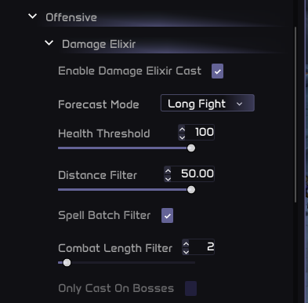

# Universal Items

## Overview

The **Universal Items** module is an optional sub-plugin of the **Universal Utility** suite. You can install it from the [Marketplace](https://project-sylvanas.net/panel/plugins/detail/110). Once enabled, it becomes accessible under:

> **Main Menu -> Universal Utility -> Universal Items**

This module provides **automated item handling** for combat situations, managing your **Trinkets**, **Elixirs**, **Potions**, and **Stones** based on custom rules, combat context, and prediction systems.

## 1 - Supported Items

- **Trinkets** Supports all trinkets, customizable for slot (Top/Bot/Both), GCD usage, cast type (self/target/skillshot), and logic (offensive/defensive).

- **Dynamic Slot** Similar to trinkets, but more flexible. The Dynamic Slot system allows you to assign **any equipment slot** (e.g., head, gloves, wrist, cloak, weapon, etc.) for **active item usage**. You can store multiple configurations, switch them based on loadouts, and delete or save custom setups. This is ideal for utility-based gear that provides clickable effects—such as belt gadgets, on-use cloaks, or weapon actives.

  You can:
  - Set and manage multiple slots dynamically
  - Customize logic for each slot (like GCD usage, conditions, cast types)
  - Pair slots with specific spells or cooldown timings
  - Save/load your configurations per spec or build

  > **Tip**
  > 
  > Think of Dynamic Slots as trinkets—but with **no slot restriction**. You choose which gear piece to activate and when.

- **Damage Elixir / Healthstone / Health Potion / Mana Potion** These items can be configured with:
  - Health thresholds
  - Distance checks
  - Combat length filters
  - Forecast mode to predict upcoming damage

### Advanced Configuration

You can access additional options like **Prediction Mode**, **Spell Data Overrides**, **Buff Pairing**, and **Cooldown Syncing** to finely tune the casting logic for trinkets and other consumables.

> **Tip**
> 
> Perfect for players who want maximum value from their consumables without micromanagement.

## Trinkets

The **Trinkets** module is designed to support **every trinket in the game**, no matter its type, cooldown behavior, or effect style. Whether it's a passive proc trinket with an on-use burst, or a complex skillshot-based trinket, this module can handle it—**as long as you configure it properly**.

> **Note**
> 
> To access this menu, go to: **Main Menu -> Universal Utility -> Universal Items -> Trinkets**

### 1 - Configuration Workflow

You only need to set up your trinket **once per item**. When you swap gear or get a new trinket, just repeat the setup for the new item.

Follow these steps:

#### ✅ Step 1: Choose Item Slot

Use the **"Item Slot"** dropdown to select:

- `Top` → activates only the top trinket slot
- `Bot` → activates only the bottom slot
- `Both` → activates both trinkets using separate logic

#### ✅ Step 2: Global Cooldown Behavior

Use the **"Global Cooldown"** option:

- `Skips Global (Common)` if the trinket **does not trigger** the GCD
- `Has Global` if the trinket **does trigger** GCD

Some PvE or PvP trinkets (e.g., Gladiator's Badge) skip the GCD and should be set accordingly.

#### ✅ Step 3: Logic Type

Select what kind of logic will handle this trinket:

- `Offensive` → used to burst enemies
- `Defensive` → used to protect yourself (e.g., damage shields)

#### ✅ Step 4: Cast Type

This tells the script how to use the trinket:

- `Self` → used on yourself
- `Target` → used on the enemy target
- `Skillshot` → casts at a position in the world

If you pick `Skillshot`, two **new submenus** will appear:

- **Prediction Settings**
- **Spell Data Settings**

---

### 2 - Skillshot Prediction Settings

These options define how to aim skillshot trinkets, like the old *Gladiator's Maledict* or upcoming AoE effects:

#### 🎯 Prediction Type

- `Most Hits` → casts where it will hit the most enemies
- `Accuracy` → aims where it's hardest for the enemy to dodge

#### 🎯 Prediction Mode

- `No prediction` → casts directly on the enemy's current location
- `Center` → aims at the geometric center of the enemy model
- `Intersection` → aims behind the target (predicts backward movement)
- `Custom` → spawns a new slider for **"Interception percentage"** → This value defines how far behind the enemy the cast will land (use with caution).

---

### 3 - Spell Data Settings

These advanced options are especially useful for skillshots or slow-cast spells:

- **Time to Hit Override** If you know your trinket takes exactly `X` seconds to hit the target, set this value to ensure prediction and timing logic works as expected.

- **Cast Delay** Adds a deliberate delay before casting the trinket (e.g., wait for stun to land before casting).

- **Conditionals** Logic filters that prevent wasteful casts, such as:
  - "Don't cast while target is immune"
  - "Only cast if enemy is not behind LOS"
  - "Only cast if more than X enemies are clumped"

---

### 4 - Presets and Min-Maxing Tools

Once you've configured the trinket, select a **preset** if available. These are pre-optimized rules for popular PvP/PvE trinkets.

> **Tip**
> 
> Under **Advanced Settings**, you'll also find:
> 
> - **Spell Pairing** → use trinket when a specific ability is also being cast
> - **Buff Pairing** → use trinket only when you have a specific buff (like Combustion or Wings)
> 
> These settings are ideal for high-end PvP or raid burst windows.

---

### Summary

Trinket automation is fully customizable, but powerful out of the box:

| Setting | Description |
|---------|-------------|
| Item Slot | Selects top, bottom, or both |
| Global Cooldown | Whether the trinket uses GCD |
| Logic Type | Offensive or Defensive purpose |
| Cast Type | Self, Target, or Skillshot |
| Prediction Mode | Aims skillshots with various prediction logic |
| Spell Data | Fine-tunes cast time and impact behavior |
| Advanced Pairing | Sync with other spells or buffs |

> **Note**
> 
> We recommend setting this up once when equipping a new trinket. You'll get perfectly timed usage every fight without pressing a button again.
