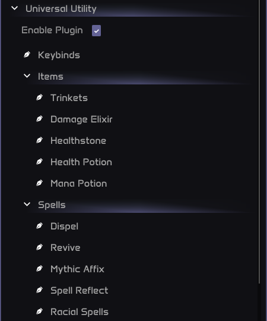

# Universal Racials

## Overview

The **Universal Racials** module is an optional sub-plugin of the **Universal Utility** suite. You can install it from the [Marketplace](https://project-sylvanas.net/panel/plugins/detail/111). Once enabled, it becomes accessible under:

> **Main Menu -> Universal Utility -> Universal Racials**

This module intelligently handles the usage of all available **Racial Abilities** (Orc, Troll, Undead, Blood Elf, etc.) based on smart combat context.

### 1 - Modes

- **Defensive** Casts racials like *Stoneform*, *Shadowmeld*, or *Will of the Forsaken* in dangerous situations, such as incoming CC or magic damage.

- **Offensive** Uses abilities like *Blood Fury* or *Berserking* during burst windows or paired with other offensive cooldowns.

### Smart Usage Logic

All racial abilities are cast under context-aware logic, such as:

- Current health
- Buff uptime syncing
- Combat duration forecasts

> **Note**
> 
> You can fine-tune these in your Advanced Settings if needed.
